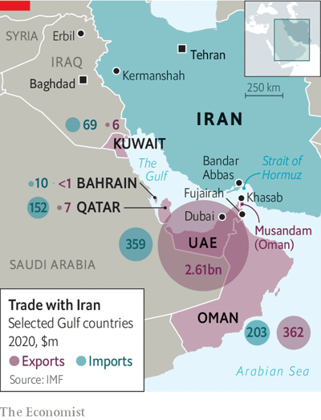

# D758 The Gulf states are an economic lifeline for Iran
> **Gulf states**：海湾国家
 > 
> **bust**：打破；摔碎；突击搜查（或搜捕）；（使）降级
 > 

1 In daylight hours the boats leaving **Khasab’s port** motor off to fish, or ferry tourists to isolated **fjord**s. After nightfall the traffic turns north. Just 100km separate this **Omani** town from the port of Bandar Abbas in Iran (see map), an hour or two’s journey by **chugging** **dhow**. This has made it a long-standing hub for smuggling—although that term suggests a level of **skulduggery** hardly apparent in Khasab’s sleepy port (pictured above). Authorities tolerate the trade, so long as it happens after dark.

> **Khasab’s port** ： 哈萨卜港
>
> **fjord**：（尤指挪威两岸峭壁间的）峡湾
>
> **Omani** ：阿曼
>
> **chug**：（发动机缓慢运转时）发出突突声；一饮而尽
>
> **dhow**：阿拉伯三角帆船
>
> **skulduggery**：阴谋诡计；花招；欺骗
>

2 A decade ago, as multilateral sanctions piled up on Iran, meant to press it into talks over its nuclear programme, boats headed north stuffed with appliances and luxury cars. On the return journey some carried **nervous-looking** sheep to be sold in the neighbouring United Arab Emirates (uae). Business is not quite so good today. Iran has closer trade ties with China and a growing manufacturing sector, both of which diminish the need for refrigerators and televisions **lashed to** dhows.

> **lashed to**：把……绑到……上面
>
> **Nervous-looking**: 紧张不安的
>

3 Still, places like Khasab illustrate the complicated relationship between Iran and its neighbours. The six-member Gulf Co-operation Council (gcc) has broadly **testy** relations with Iran. But political tensions coexist with deep economic ties, which have become increasingly vital as world powers seek to revive the agreement of 2015 that imposed limits on Iran’s nuclear work in exchange for easing sanctions.

> **testy**：急躁的、易怒的
>

4 In 2018 Donald Trump withdrew America from the deal, which is now largely **defunct**. On March 11th, after almost a year of talks, negotiators in Vienna put their work on “pause”. They had been close to an agreement until Russia demanded that its trade with Iran be exempted from Western sanctions. That was a patent ploy to create a way around the tough sanctions imposed on Russia after it invaded Ukraine.
Russia’s demand threatened to **derail** the whole process—or perhaps not. Russian diplomats now say they never sought loopholes, merely a promise that their obligations under the deal, such as taking custody of Iran’s excess enriched uranium, would not be affected by sanctions.

> **defunct**：不再存在的; 不再起作用的
>
> **ploy**：计策、手段
>
> **derail**： 脱轨
>

5 On March 15th Sergei Lavrov, Russia’s foreign minister, met Hossein Amirabdollahian, his Iranian counterpart, in Tehran. Both said Russia was no obstacle to a deal. **Barring** another **about-face**, that leaves America and Iran to resolve a few **glitche**s, mostly about sanctions relief. Iran’s release of two British-Iranians hinted at its desire to **mollify** Britain. One of them was Nazanin Zaghari-Ratcliffe, who was held for six years in prison and under **house arrest**. Her case was not connected to the nuclear deal.

> **Barring**：除非；除了
>
> **about-face**：突然改变(看法,立场等)；大转变；
>
> **mollify** ：使平静；抚慰
>
> **glitch**：小故障；小毛病；小差错
>
> **house arrest**：软禁
>

6 An agreement would prompt mixed emotions in the gcc. Oman, on friendly terms with Iran, is an **outlier** in the bloc. The uae is closer to the **mean**. It sees Iran as a threat; they have a territorial dispute over three islands in the Persian Gulf. But they also have the tightest economic ties of any Gulf states, thanks in part to a large community of Iranian émigrés in Dubai. The two countries are big trading partners: Iran takes around 3% of the uae’s annual exports. There is talk of doubling bilateral trade to $30bn in 2025. Billions of dollars of Iranian assets sit in Emirati banks.

> **mean**: 平均值
>
> **outlier** ：离群值；异常值
>

6 Initially happy with Mr Trump’s withdrawal from the nuclear deal, the uae soon changed its mind. In 2018 and 2019 Iran and its **proxies** staged a series of attacks in the gcc, sabotaging oil tankers near **Fujairah**, a uae **statelet**, and hitting Saudi oil facilities with drones and **cruise missiles**.
That prompted a policy change. Despite American sanctions, Iran has been exporting up to 1m barrels a day of oil, mostly to China. Some of this oil is shipped through third countries to hide its origin. The uae has become a big part of this trade: Bourse and Bazaar, a think-tank in London, estimates that some $13bn worth of Iranian crude reached China via the uae in the first nine months of 2021. Much of that money is spent on imported goods from the uae.

> **proxy** ：代理(权)；代表(权)
>
> **Fujairah**:富吉拉
>
> **statelet**:（尤指大国分裂后形成的）小国
>
> **cruise missiles**:巡航导弹
>

7 All of this rankles American officials. In December a delegation from the us Treasury flew to Abu Dhabi, the capital of the uae, to complain about sanctions-busting. Well before then, the Trump administration was angry with Qatar for undermining its “maximum pressure” campaign against Iran. After three of its Gulf neighbours imposed a blockade on it in 2017, Qatar boosted trade with Iran, with imports climbing five-fold to $418m within a year.

> **Rankle**： (事件或局面)令人愤怒
>

8 Economic diplomacy has its limits. The uae had hoped that trade ties with Iran would help shield it from further attacks. Tahnoun bin Zayed, the Emirates’ powerful national-security adviser, has advocated **detente**, visiting **Tehran** last year. Since January, though, Iranian-backed groups in Yemen and Iraq have **lob**bed a series of drones and missiles at Abu Dhabi, killing three people and denting the country’s reputation for stability.

> **detente**:(两国关系)缓和
>
> **Tehran**:德黑兰
>
> **lob**:高扔，高抛
>

9 Still, despite the attacks, Iran’s trade minister led a large delegation to the uae last month. “They didn’t talk about it much in the media. But they didn’t cancel it either,” observes a Western diplomat. If the nuclear deal is revived, the Emirates can offer billions of dollars of needed trade and investment in exchange for regional calm. If it is not, the dhows in Khasab may find their cargoes piling up once again. ■

