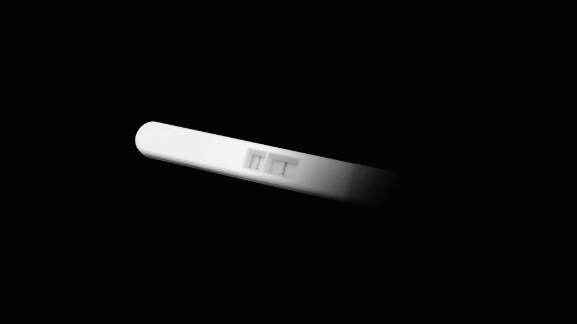

# D763 The Fragility of Those Two Pink Lines

1 You appeared for the first time on a Tuesday afternoon. You were faint, barely perceptible, but you were there: a pale line on a test strip that I’d dipped into a cup filled with my pee. I set you down on the ledge of the bathroom sink and tried to get back to work, but I couldn’t stop looking at you.
Staring out the window in front of my desk, I imagined all the weird kid questions you’d ask. Do clouds smell? What are worms? Where did I come from? I imagined my response—“You came from a cup of my pee”—and you scrunching your little face. I lingered in this fantasy a while longer, then looked down at my keyboard and picked at the crumbs lodged between the keys. What if you’re gone before I get a chance to meet you? I wondered.

2 Six months earlier, I’d had a miscarriage. I was sitting on a cold, hard table, staring at an ultrasound when the doctor pointed out that the fetus was small. Too small. She pressed a button and made me listen to the empty sound of my womb—what I imagine space sounds like—as she told me that this is common, then slid the ultrasound wand out of my body. When the embryo doesn’t progress as it should, she said, the body has a way of taking care of it. She meant to be comforting. Instead, I was left with the unsettling thought that my body could make a decision without my consent.

3 But here I was, pregnant again. Worrying about another miscarriage, I knew, wouldn’t keep it from happening. I should’ve been picking out names, registering for classes, and researching strollers. But I didn’t let myself get swept up in excitement. Psychologists call this “emotional cushioning.” “Women pregnant again after prior perinatal loss fear another loss and thus protect their emotions and avoid prenatal bonding,” researchers wrote in a 2011 study on 63 pregnant women who had lost previous pregnancies. “They try not to think too deeply about the future with this baby because it may never come to be.”
Emotional **cushioning** is self-protection—a way to “cope with the anxiety, uncertainty, and sense of vulnerability” that comes with pregnancy. But protection comes at a price. When you block out the fear of losing something, you also block out the joy of experiencing it.

> **cushioning**:起缓冲作用的物体；缓冲作用
>

4 One of the worst parts of pregnancy anxiety is that you don’t want to admit you’re feeling it; that would mean admitting you have something to lose, which only makes you more scared to lose it. “These women may not truly acknowledge the depth of their fear,” the 2011 study states. Like those subjects, I couldn’t bring myself to reflect too much on my growing **neuroses**.

> **neuroses**:精神官能症
>
> Instead, to make sure you were still there, I took another test. Then another. I started taking tests throughout the day. They all turned pink. But were they pink enough? I compared the pinkness of each line to the pinkness of the lines on the other tests. I took maybe 20. I sometimes drew open the curtains in my bedroom and held the tests under the sunlight, like a jeweler examining a diamond.
>

5 I measured you in discomfort: How queasy do I feel today? I quantified my abdominal pains for an app that said you were the size of a **lentil**. A lentil! But how could I know for sure? One day I bled and spent four hours on my phone, thumbing through photos of other women’s blood posted in online forums. Eventually, I fell asleep, surrendered to the thought that you were gone. I was mentally preparing to let you go. I wasn’t doing it on purpose, and I was sorry for doing it at all.

> **lentil**:小扁豆
>

6 I wanted to be the pregnant woman who is glowing, who talks about her food cravings, who is already picking out **onesies** and reading books. I wanted to plan for my future as a mother, but planning felt dangerous. At the same time, I was anxious about what might happen if I didn’t plan, or let myself imagine our future together. “I felt as though I could not emotionally attach myself to this baby inside me until I actually held him,” one woman in the study said. If I get a chance to hold you, I wondered, will I regret all the time I spent worrying—time I could have spent bonding with you, talking to you, reading to you in the womb? Will worrying make connecting with you harder? Will you feel like a stranger?

> **onesies**: 宝宝衫，连体衣
>

7 Sometimes it felt like two alternate worlds existed: In one I’d lose you. In the other you’d live. I was **hurtling** toward one of those realities, but I didn’t know which. I thought of the famous “Schrödinger’s cat” thought experiment, in which a hypothetical cat is trapped inside a box with a vial of poison. While the cat is inside the box, it could be dead or alive, depending on whether the radioactive decay of an atom triggers the poison’s release. The quantum theory of the time would have said that until you open the box and observe the cat, both scenarios exist.

> hurtling:飞驰
>

8 Schrödinger aimed to illustrate the absurdity of that idea: A cat cannot be both dead and alive at once. But it didn’t sound so silly to me anymore. At an appointment on an early summer morning, I sat in a cold room with my pants down and a thin sheet draped over my legs. I tried not to think about the last time I sat under a sheet like this. After all, this was different. It was a different office, with different lighting. Dim and yellow, like autumn. There were photographs here: a young family, a golden retriever. But the giant machine next to me smelled like plastic and hummed like my anxiety. I was staring down two simultaneous realities. In one, I drove home happy. In the other, I picked up a bottle of wine and asked my mother to stop telling people I’m pregnant.

9 The doctor knocked, a gesture to respect my privacy even though she was about to reveal secrets about my body so private that even I didn’t know them. Her voice was loud as she asked how I felt. Nervous, I said. “Don’t be,” she said, like it was that easy. Dr. Loud moved the wand around my uterus, searching. She slid her dry finger across a **matte** screen. “I see something,” she said.
Right there, on the fuzzy black-and-white monitor, I saw you. A pale dot in the universe of my womb. And I heard you—there was a sign of life, and it sounded like a **techno remix** of **Darth Vader** breathing. “That’s crazy,” I said out loud, probably the dumbest thing a parent could say seeing her child for the first time. “Congratulations,” the doctor told me. You exist; you are breathing, I thought. Or, at least, you are beating. You are there, a collection of atoms that will someday call me Mom, Mother, Mama. I don’t know.

> Matte: 哑光的，无光泽的
>
> **techno remix**： 电子混音
>
> Darth Vader: 星球大战中的达斯维达
>

10 I sat up, put my pants back on, and looked at the photo the doctor gave me—the first real image of you. You were a hazy white blob, like a ghost in an old photograph. Gently, I placed you inside my bag. Years from now, I thought, maybe you will have your own laugh, your own favorite movies. Maybe you’ll like country music. Maybe you’ll be one of those people who don’t like **cilantro**. You might someday be a full-**fledged** person, when right now, you are just a picture in my purse.
But the picture captured only a single moment. I couldn’t know what the next moment would hold—or the one after that. I’ll stop worrying at 12 weeks, I told myself. Or maybe 24. Or 36. Maybe a thousand weeks.

> cilantro:香菜 （coriander）
>
> fledge:羽翼丰满的
>

11 Now, months later, you’re in my arms. You look at me, and I move to the left, then to the right. “What do you see?” I ask, scratching your belly. The corners of your mouth curl up a little. The first sign of a smile.
The worrying hasn’t gone away. If anything, it’s gotten worse. Our future still contains potential for joy and pain, just as it did that day at the doctor’s office. Inevitably, in ways big or small, both will exist simultaneously. My mind wanders to those possibilities.
I bring myself back to this version of reality. In this version, you are here.

> **curl up**：卷起；蜷伏
>

