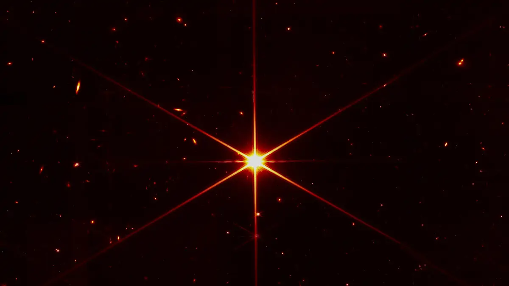
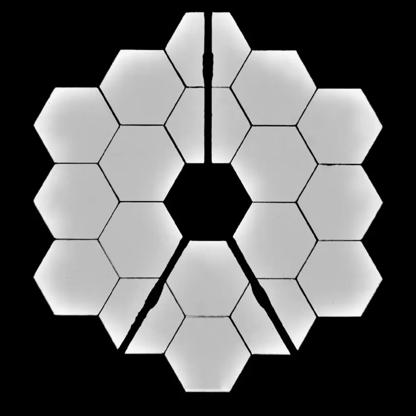
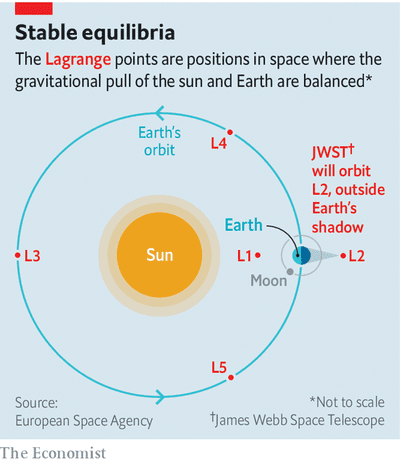

# D765 “Better than our most optimistic prediction” – first images from James Webb exceed all expectations
> **Non-descript**: 无特色的; 毫无兴趣的; 毫无吸引力的
 > 
> deep-field：深空
 > 
> **1 Images of a very “boring” star are making waves across the astronomical world today** – they are the first sent back from NASA’s James Webb telescope, and they have exceeded all hopes and expectations.
 > 
> Having completed the self-assembly of its 18-segmented main mirror, the telescope has now taken exceptional images of an unexceptional star as a test of its capabilities. The star, known as HD84406, is 100 times fainter than what can be seen with the human eye. The star itself is of little interest, lovely though its image is – instead, astronomers are captivated by the spray of tiny dots scattered across the background. Each is a distant galaxy, and this is the first time we’ve ever been able to capture them.
 > 

2 In a virtual briefing, NASA officials expressed their overwhelming joy and relief at what these first images represent.
“We said last fall that we would know that the telescope is working properly when we have an image of a star that looks like a star,” says Lee Feinberg, Webb optical telescope element manager at NASA’s Goddard Space Flight Center. “Now you’re seeing that image. And I’m happy to say that the optical performance of the telescope is absolutely phenomenal, it is really working extremely well. The performance is as good if not better than our most optimistic prediction.”

3 These first images are not scientific – instead, they’re engineering images, designed to test how smoothly all the many parts of this engineering marvel are working together. The $US10 billion dollar telescope is **staggeringly** complex in design, and the stakes are high – where the Hubble telescope orbits the Earth, within our reach to service, James Webb sits approximately 3000 times further away, orbiting the Sun. While this extends our view of deep space phenomenally, it also means that we have no option to make adjustments or repairs if something goes **awry**.
The pressure to ensure each and every component of the telescope was perfect before launching it into space was enormous, and lead to a number of delays.

> **staggering**：令人震惊的
>
> **awry**：未按计划运行的、脱离轨道的
>

4 But since its launch in December 2021, every stage of deployment has progressed flawlessly.
The telescope’s main mirror is 6.5 metres wide, and composed of 18 **hexagonal** segments that self-assembled in space. The alignment of each of these segments to complete a single, smooth reflecting surface requires nanometre-scale precision. Until now, there has been no way to confirm how well the process has unfolded, and the wait for these first images has been a nervous one. The relief that accompanies this stellar portrait is almost **tangible**.

> **hexagonal** ：六边形；六方
>
> **tangible**：切实的；可触知的；实实在在的
>
> This new “selfie” was created using a specialized pupil imaging lens inside of the NIRCam instrument that was designed to take images of the primary mirror segments instead of images of the sky. This configuration is not used during scientific operations and is used strictly for engineering and alignment purposes. In this image, all of Webb’s 18 primary mirror segments are shown collecting light from the same star in unison. Credit: STScI / NASA
>

5 “The telescope’s performance so far is everything that we dared to hope,” says Jane Rigby, Webb operations project scientist at Goddard. “The engineering images that we saw today are as sharp and as **crisp** as the images that Hubble can take, but are at a wavelength of light that is totally invisible to Hubble. So this is making the invisible universe **snapping** into very, very sharp focus.”

> **crisp**: clear and sharp
>
> **sharp focus**：清晰聚焦
>
> **snap**: 拍照
>
> **First images are a clear demonstration of James Webb’s capabilities**
>

6 More than just confirming that the telescope is operating smoothly, these first images are also a clear demonstration of James Webb’s capabilities.
One hundred times more sensitive than Hubble, and operating in the realm of **infrared**, James Webb is already capturing galaxies far more distant than any we have before.
“There’s no way that Webb can look for 2,000 seconds at any point in the sky, and not get an incredibly **deep field**,” Rigby says. “This is going to be the future from now on. Wherever we look, it’s a deep field. Without even really **breaking a sweat**, we’re seeing back in time to galaxies that we’re seeing the light as it looked billions of years ago.”

> **infrared**: 红外线
>
> **Break a sweat**:汗流浃背
>
> **deep field**：深空影像；深场；深宇宙
>

7 And the process has only just begun.
James Webb carries four scientific instruments on board, but only one – the Near Infrared Camera (NIRCam) that helped to deliver these first images – is currently operational. NASA believes the remaining three will be in action and ready to begin the scientific imaging process in June or July.
These images will allow us to peer back in time to capture galaxies from the early days of our universe, only a few hundred million years after the Big Bang – potentially transforming our understanding of galaxy formation and evolution.

8 “The James Webb Space Telescope is going to **shed light on** the universe in a few different ways,” says Dr Rebecca Allen, from the Swinburne University of Technology’s Space Technology and Industry Institute. “It will be able to capture the distant starlight from galaxies that has been redshifted from UV wavelengths to the infrared – meaning we can literally see further back when the universe was younger to understand more about how the first galaxies formed and grew.”
But it’s not all about looking far away, says Allen.
“The telescope’s infrared instruments are also perfectly suited to helping us reveal more about the nearby universe by studying planets outside our solar system. I’m very excited to see the telescope take **spectroscopy** of distant worlds as they pass in front of their stars and hopefully confirm the existence of water beyond Earth.”

> **shed light on**：阐明；解释；将…弄明白
>
> **spectroscopy**：光谱学
>

9 Finally, the James Webb Space Telescope is what’s known by astronomers as a ‘dust **buster**’.
“Both near and far where planets and stars are formed there’s heaps of dust,” explains Allen. “Because over time stars enrich the universe as they create heavier elements in their cores. Dust is annoying because it loves to absorb the bright light coming from stars, **shrouding** our view of these important regions and even making distant galaxies harder to see. But this light is re-emitted at longer wavelengths that JWST will be able to see, allowing us to learn more about how planetary systems like our own were formed.
“With the telescope up and aligned, the next decade (or two!) will be full of incredible discoveries. Stay tuned!”

> **shroud**：覆盖；隐藏；遮蔽
>
> **buster**：表示“破坏者”
>
> 可以参考 D675 A new look at the ljcosmos
>

