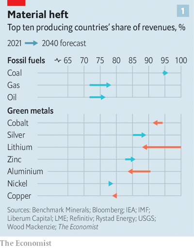
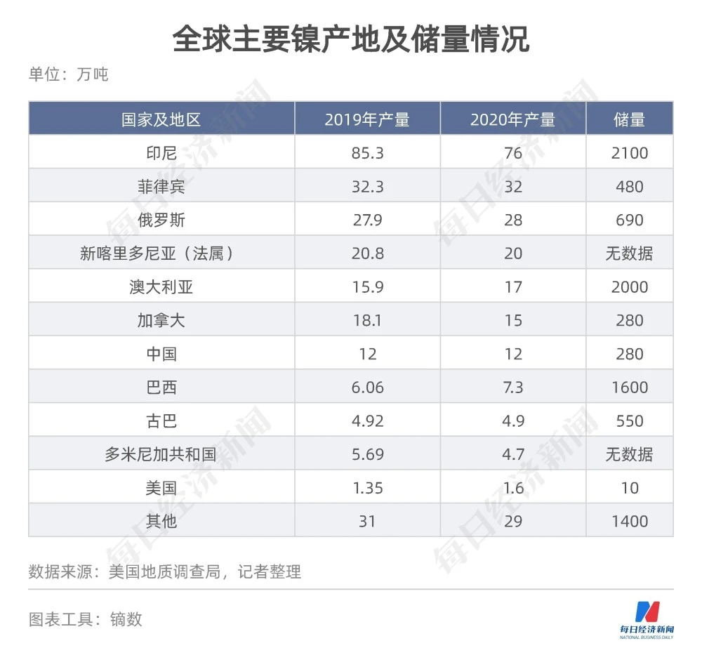

# D766 Why energy insecurity is here to stay
> **petrostate**:石油国家
 > 

1 Energy and commodities lie at the dark heart of Vladimir Putin’s regime and the threat it poses to the world. Four trillion dollars of oil and gas exports over the two decades of his rule have paid for the tanks, guns and Grad missiles now killing Ukrainians. Natural-resource earnings have entrenched a rent-seeking elite that has created an offshore archipelago of yachts, nightclubs and Caribbean front companies, stifled representative politics and indulged Mr Putin’s megalomaniacal fantasies.

> **entrench**:根深蒂固;巩固
>
> **rent-seeking**：寻租行为；竞租行为
>
> **archipelago**:群岛，列岛
>
> **stifle**:扼杀；抑制；压制；阻止
>
> **megalomaniacal**: 妄自尊大的 someone who has an unnaturally strong wish for power and control, or thinks that they are much more important and powerful than they really are
>

2 As Russia supplies 10-25% of the world’s oil, gas and coal exports, many countries, especially in Europe, are vulnerable to **coercion** by it. For them, the war in Ukraine has been a shock that adds urgency to the creation of an energy system which depends more on sun, wind and nuclear reactors than on **derricks** and **rigs**. Yet don’t fool yourself that this new era will allow an easy escape from the curse of energy crises and autocrats.

> **coercion**：强迫
>
> **derrick**：起重机
>
> **rig**：钻井架
>

3 Weeks of chaos in energy markets are beginning to hurt consumers. Petrol prices in Los Angeles are over $6 a gallon for the first time. As sanctions on Russia bite, traders predict, Europe will run short of diesel. Germany is preparing to ration natural gas next winter, in case Russia cuts off supplies. In Asia, oil importers are **bracing** for a balance-of-payments hit. In a tight market, shocks are hard to absorb. Oil spiked at $122 per barrel this week after a pipeline from Central Asia to the Black Sea suffered storm damage and Iranian-backed Houthi rebels attacked Saudi energy facilities.

> **ration**: 配给; 限定…的量; 定量供应
>
> **brace**：准备 (面对不愉快或困难之事)
>
> **balance-of-payment**：收支平衡
>

4 The immediate reaction of governments everywhere has been to scramble to find more fossil fuels, however polluting to the environment or painful to their pride. With Western encouragement, Saudi Aramco, the world’s biggest oil firm, is raising investment to $40bn-50bn a year. At one point, the Biden administration buttered up Nicolás Maduro, Venezuela’s dictator, perhaps to get more oil from a state which in 2005 supplied 4% of the world’s crude.

> **Butter up**: 对……说好话；恭维，阿谀奉承
>

5 The longer-term question being asked by many is: how fast can they abandon fossil fuels altogether? The energy strategy announced this month by the eu **envisage**s independence from Russia by 2030—in part by finding new sources of gas, but also by **doubling down** on renewables. As the **folly** of relying on Russia becomes clear, nuclear power is back in fashion. France plans to construct six new plants and is aiming for “total energy independence”. On March 21st Britain said it would build a new generation of reactors at “**warp speed**”. A redesigned energy system that will **belch out** less carbon also promises an escape from the 20th century’s great game of relying on energy from despots.

> **envisage**：设想、展望
>
> **doubling down**：加倍下注；下大工夫
>
> **folly**：荒唐事、愚蠢
>
> **warp**：扭曲的
>
> **warp speed**：极高速
>
> **belch**：喷出
>
> **belch out** ：喷出；倾吐
>
> **despot**：专制君主、暴君
>

6 Yet although geopolitics will **hasten** the climate-driven energy transition, they will not make it risk-free. The transition will disrupt some economies and cause new dependence on others. To gauge this we have simulated spending on a basket of ten natural resources, including oil and coal, and the metals used in power generation and the electrification of industry and transport. As the world decarbonises, spending on this basket will fall from 5.8% of gdp to 3.4% by 2040. Yet in our simulation over half of that will still go to autocracies, including new electrostates that provide green metals such as copper and lithium. The top ten countries will have a market share of over 75% in all our minerals, which means production will be dangerously concentrated.

> **hasten**:加速
>
> **copper**:铜
>
> **lithium**:锂
>

7 Two problems therefore stand out. First, the geopolitics of shrinking the oil industry are fraught. As Western firms withdraw for environmental reasons and in response to high costs, the market share of opec plus Russia will rise from 45% to 57% by 2040, giving them more clout. Higher-cost producers such as Angola and **Azerbaijan** face a shock as they are squeezed out. The world map will be **peppered** with distressed ex-petrostates.

> **Azerbaijan[ˌæzərbaɪˈdʒɑːn]**：阿塞拜疆
>
> **peppered**：布满了
>
> freckled：生斑点；布满斑点
>

8 Second, the emerging electrostates face their own battle with the resource curse. Spending on green metals will surge amid a two-decade-long build-out of electric infrastructure. The **windfall** may be worth over $1trn a year by 2040. Some beneficiaries, such as Australia, are well-equipped to deal with this. More fragile states, including Congo, Guinea and Mongolia, are not. Mountains of cash distort economies and feed **grievance**s. Mining was a source of discord in recent elections in Chile and Peru. Global mining firms are nervous that their property rights will be buried. A resulting lack of investment has sent the price of a basket of green metals up by 64% in the past year. All this is **compounded** by China, which is hunting for the same resources, but is more tolerant of bad governments.

> **build-out**:增建；扩建
>
> **windfall**：意外之财
>
> **grievance**:委屈；抱怨
>
> **discord**：分歧，不和谐
>
> **compound**：恶化、加剧
>

9 As with all commodities, soaring prices will eventually trigger a market response. Tight supply gives firms a huge incentive to step up recycling and to innovate. New kinds of small-scale nuclear reactors are emerging. Tesla, which uses minerals to make electric cars, is developing new battery designs. It has also struck a supply deal with New Caledonia, a Pacific territory of 277,000 people you will hear more about because it has a tenth of the world’s **nickel** reserves. This month Barrick, a Canadian firm, took a deep breath and agreed to develop a $10bn copper mine in Pakistan.

> **nickel** :镍
>
> **step up**：加紧增加
>
> **New Caledonia**:新加勒多尼亚
>
> **High-voltage rewiring**
>

10 Yet even as markets respond, governments must also **redouble** their efforts. Because self-sufficiency is rarely an option, diversification is the goal. That means new partnerships. On March 20th Germany began talks with Qatar for gas. The **invigoration** of the rich world’s nuclear industry is key, not least because it frees everyone else from relying on Chinese and Russian technology. Governments must catalyse mining investment. Firms should not be free to blow up sacred caves or endanger workers, but the transition requires more mining projects in high-risk countries at a cost to the local ecology. Governance rules in wealthy countries need to acknowledge the **trade-off**. Finally, rich-world governments should help electrostates prepare by, for example, helping design model contracts for a fair split of revenues and establishing sovereign-wealth funds to save the **bounty**.
Building a cleaner and safer energy system is an epic, risky and daunting task. But whenever resolve flags, ask yourself: would you rather rely on Mr Putin’s Russia?

> **rewire**:重新布局/接线
>
> **redouble**：加倍；增加
>
> **invigoration**：增益精力；滋补；鼓舞
>
> **trade-off**: （在相互对立的两者间的）权衡
>
> **bounty**：赏金；奖金
>

