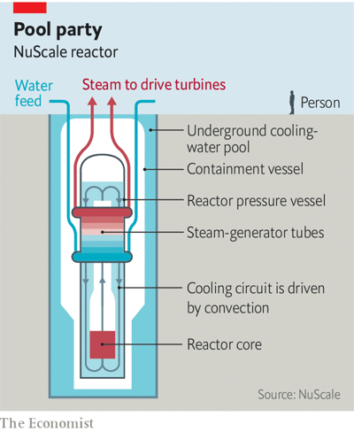

# D768 Developers of small modular reactors hope their time has come
1 Nuclear power has never quite lived up to its promise. Reactors have proved much more expensive than hoped. Accidents and leaks have given it a reputation for being risky despite its zero-carbon **credentials**. (Attempts to point out that coal-fired power kills far more people than the nuclear variety have failed to convince many voters.) Nuclear’s share of the world’s electricity production fell from 17.5% in 1996 to 10.1% in 2020.

> **credential**：资格
>
> **SMR**：小型模塊化反應堆
>

2 But governments committed to ambitious climate-change targets have been giving the technology a second glance. In January the European Union added nuclear power to a list of projects eligible for green finance. Russia’s invasion of Ukraine, meanwhile, has sent fossil-fuel prices soaring, and put energy security at the top of the political agenda in Europe, which currently relies heavily on Russian natural gas. The nuclear industry reckons it has just the answer: a new generation of small modular reactors (smrs), designed to be cheaper, quicker and less financially risky to build.

3 In 2019 Russia connected the Akademik Lomonosov—an experimental ship-borne smr—to its power grid. China, which has more big reactors under construction than anywhere else, hopes to have its first commercial smr operating in Hainan by 2026. Last year Britain’s government said it would accelerate plans to build 16 smrs designed by Rolls-Royce. NuScale Power, an American firm, hopes its first smr, to be built at Idaho National Laboratory, will be providing power by 2029. The International Atomic Energy Agency reckons “about 50” smr designs are being worked on around the world.

> **Of Henry Ford and fission**
>

4 As the name suggests, smrs are smaller than standard nuclear plants. Typically, they are intended to produce less than 300mw of electricity, roughly a fifth of what a standard reactor might manage. Their size means that, as with cars, toasters and tin cans, their developers aim to use mass production in factories to cut costs.
“In a typical large reactor you’re assembling most things in the field,” says Chris Colbert, NuScale Power’s chief strategy officer. “You might have 8,000 people working on the site.” NuScale, with plants designed to produce 77mw of electricity, hopes to move as much of that work as possible into special factories, for later assembly on site. Factories offer protection from weather delays, he says. And having a regular supply of work in one place means there is no need to train a new batch of construction workers for every plant. “Something that takes 17 hours in a field might take just a single hour in a factory,” he says. Instead of tying up capital for decades building a big plant, customers could see a return on investment much sooner.

> **mw**: megawatt百万瓦特
>

5 NuScale’s design has a 23-metre-tall, **lozenge**-shaped reactor vessel that sits in a steel-lined **subterranean** pool of cooling water (see diagram) and is capped by a reinforced-concrete reactor building. Several plants can be combined into a large power station, or a few used to provide power to a single site. Such **modularity** implies redundancy, too, since individual reactors can be switched off for refuelling while the rest keep running.
Going small also offers opportunities to simplify the design, which helps keep costs low. The cooling water in NuScale’s plant circulates through the core by simple **convection**, requiring no pumps or moving parts. And smallness, says Mr Colbert, brings safety benefits, too. Even if the internal cooling were to fail, the external water in the pond has enough capacity to absorb the **diminutive** reactor’s heat production. Besides its **putative** plant in Idaho, NuScale has seen expressions of interest from Kazakhstan, Poland and Romania.

> **lozenge[ˈlɑːzɪndʒ]**：菱形
>
> **modularity**：模块化
>
> **subterranean**：地下的；秘密的
>
> **redundancy**：冗余度
>
> **convection**：（热通过气体或液体的）运流
>
> **di'minutive**：小型的，微小的
>
> **putative** ：推定的，假定的
>

6 Other smrs stretch the definition of “small”. Rolls-Royce’s are designed to produce 470mw of electricity—more than most of the first-generation Magnox nuclear power stations Britain began building in the 1950s. That requires the sorts of active safety systems found in ordinary nuclear power stations, such as **coolant** pumps and backup generators to ensure constant running if something goes wrong. This adds complexity, and therefore cost.
But most analysts reckon bigger size means economies of scale, and thus cheaper power. “The reason we’re at 470mw is that’s the most power we can get out of our footprint, while keeping every component fitting on a lorry,” says Alastair Evans, a spokesman for Rolls-Royce. The firm hopes that, when and if its production line is up and running, each of its **jumbo** smrs should cost £1.8bn ($2.4bn) and take around four years to build. It has seen interest from America, the Czech Republic and Turkey.

> **footprint**：占用空间、覆盖区一
>
> **coolant**：冷却剂；冷却液
>
> **jumbo** ：巨型/大的
>

7 NuScale, Rolls-Royce and the China National Nuclear Corporation, which is building the plant in Hainan, are sticking with **tried-and-true** designs. All their proposed plants are light-water reactors (lwrs), which use ordinary water both to cool the core and to moderate the speed of the nuclear chain-reaction. Since most of the world’s existing reactors are also lwrs, they hope sticking with the same general design will speed up regulatory approvals. (NuScale’s design was approved by America’s Nuclear Regulatory Commission in 2020, four years after it was submitted.)
Other designs are more exotic, relying on **molten lead** or **sodium**, or **gaseous** helium, instead of water, to cool their cores. x-Energy and u-Battery, American and British firms respectively, are betting on **miniature** **helium**-cooled reactors. These operate at much higher temperatures than lwrs. The helium in u-Battery’s reactor will reach temperatures of about 750°C, says Tim Abram, the firm’s chief engineer.

> **tried-and-true**：经过检验而可靠的；靠得住的
>
> **molten**：融化的
>
> **lead**：铅  /liːd; led/
>
> **sodium**：钠
>
> **gaseous**：气态的；含气体的
>
> **miniature**：很小的；微型的
>
> **helium**: 氦
>

8 This means that, besides electricity, such reactors could also sell heat. Many industrial processes run at high temperatures. At the moment, that comes mostly from burning fossil fuels. u-Battery hopes its reactors might one day find a home in industries ranging from glass and **ceramics** to steel, cement and paper. They could even, says Mr Abram, be used to produce hydrogen for energy storage via a process called thermochemical splitting, which employs heat rather than electricity to **cleave** water into oxygen and hydrogen.
It all looks good on paper. But history counsels a degree of scepticism. Previous attempts to build commercial smrs, dating back to the 1960s, have **foundered** **on the twin rocks** of economics and technology. The biggest difficulty, says M.V. Ramana, a physicist at the School of Public Policy and Global Affairs at the University of British Columbia, is that small reactors start at a disadvantage to their bigger cousins. The cost of building a reactor grows more slowly than its power output, he says. Other things being equal, bigger means cheaper.

> **ceramics**：陶瓷
>
> **cleave**：劈开
>
> cleavages:(妇女穿低胸服时露出的)乳沟
>
> **cement** ：水泥
>
> **thermochemical splitting**：热化学分解法
>
> **counsel**：建议
>
> **scepticism**：怀疑态度
>
> **founder**：失败
>
> **On the rock** : 触礁
>

9 Whether mass production can overcome that disadvantage remains to be seen. Nu Scale’s Idaho plant is paid for in part by federal subsidy. But costs have risen, says Dr Ramana, from $3.6bn in 2017 to $6.1bn in 2020. Several of the firm’s commercial partners pulled out of the project in 2020. That is not encouraging for a technology which must compete for low-carbon investment with solar and wind energy, the costs of which continue to fall.

> **If at first you don’t succeed...**
>

10 Nuclear power is, however, these days looking less expensive than it did. One big plant under construction in Britain, on the coast of Somerset, had to be promised an inflation-linked electricity price starting at £92.50 per megawatt-hour in 2013. At the time, this deal was condemned as too expensive. But amid gas shortages and a **dearth** of wind, British electricity costs have been above that level for most of the past six months.
The International Energy Agency points out that once the need for storage or backup generation is taken into account renewables are more expensive than their sticker price suggests. And, as Russia’s invasion of Ukraine shows, energy policy must weigh factors beyond **bean-counting**. Whether smrs can help make nuclear power attractive again remains to be seen. But their advocates are unlikely to get a better chance to make their case.

> **dearth**：不足
>
> bean-counting：数豆子（官僚式计数法） financial decision-making or analysis done by bean counters
>
> **Bean counter**:  a person, typically an accountant or bureaucrat, perceived as placing excessive emphasis on controlling expenditure and budgets.
>
> Beans are a cheap **commodity**, so to count them is a rather silly thing to do. A "bean counter" is one who nitpicks over **small things** in order to save costs. It is a derogatory term for accountants, **bankers**, and anyone who holds a financial interest in an endeavor
>

