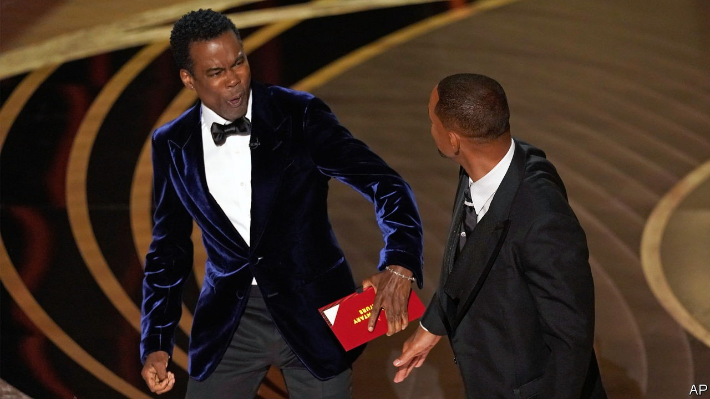

# D769 Have the Oscars lost their way?

1.Remember when the most embarrassing Oscars **mishap** involved Warren Beatty and Faye Dunaway announcing “La La Land” rather than “Moonlight” as the Best Picture in 2017? Ah, what an innocent time that was! On March 27th the 94th Academy Awards fell much deeper into **disrepute** when Chris Rock was on stage, preparing to hand over the prize for Best Documentary. The **comedian** made a few jokes, including one about Jada Pinkett Smith’s short hair, a consequence of her **alopecia**. **Incensed**, Will Smith, her husband, **strode onto** the stage and slapped the comedian across the cheek. “Keep my wife’s name out of your fucking mouth!” he shouted at Mr Rock.

> **mishap**：小事故；晦气
>
> **disrepute**：丧失名誉；坏名声
>
> **comedian**：（讲笑话或趣事的）滑稽演員
>
> **alopecia**：脱发
>
> **Incensed**:非常愤怒的
>
> **stride** ：跨过；大踏步走
>

2.Despite the clash, the show went on. Mr Rock presented the documentary feature prize to a deserving winner, Ahmir “Questlove” Thompson, for “Summer Of Soul (...Or, When the Revolution Could Not Be Televised)”, his **joyous** chronicle of the Harlem Cultural Festival of 1969. Ten minutes after that, Mr Smith himself won Best Actor for his performance in “King Richard”, an authorised **biopic** of the father of Serena and Venus Williams. He didn’t take the opportunity to apologise to Mr Rock, or to condemn acts of violence. Instead, he declared that “Richard Williams was a fierce defender of his family”, adding that he was “overwhelmed” by what God was calling him to do. “Love will make you do crazy things,” he concluded. In return for this dangerous, self-serving **cant**, he was given a standing ovation.

> **joyous**:高兴的；快乐的
>
> **biopic**:名人传记片
>
> **cant**:hypocritical and sanctimonious talk, typically of a moral, religious, or political nature
>
> the expression or repetition of conventional or trite opinions or sentiment
>

3.It was a **queasy** spectacle that underlined doubts about the function of the Academy Awards. What purpose do they serve? One answer is that they publicise the films that win prizes. A lot more people will watch Sian Heder’s “CODA”, a feel-good indie comedy-drama about a Massachusetts fishing family with three deaf members, now that it has won Oscars for Best Picture, Best Supporting Actor and Best Adapted Screenplay. But do the Academy Awards achieve anything else?

> **queasy**: 恶心的；欲吐的
>
> **indie**:独立的，不属于大公司的
>
> CODA:《健听女孩》是翻拍**电影**，原作是《贝利叶一家》
>

4.In theory, they celebrate the art and craft of film-making, but they did a woeful job of that this year. Under pressure from abc, the television network, to tighten the running time, the organisers decided that the prizes for animated short film, **live-action short film**, documentary short, film editing, makeup and hairstyling, original score, production design, and sound would all be presented before the broadcast began. The winners’ **acceptance speech**es were then spliced into the televised proceedings, but with their walks to the stage and their **pause**s edited out. In effect, the ceremony became a two-tier event in which some parts of the industry were deemed less important than others.

> **acceptance speech**: 获奖感言；提名演讲
>
> **live-action short film**：最佳实景短片奖；最佳真人短片
>
> **original score**：原创配乐
>

5.Alternatively, perhaps the Oscars exist to reward Hollywood’s biggest **money-spinner**s? If so, the organisers made a mess of that, too. In a flailing attempt to broaden their appeal, the producers added two categories for which votes were cast on Twitter. They were the Cheer Moment, which went to Zack Snyder’s “Justice League”, and the Fan Favourite, which went to another of his films, “Army of the Dead”. Neither of these online releases were commercial hits, and so the **spurious** new awards merely demonstrated how adept Mr Snyder’s fans are at using Twitter.

> **money-spinner**：赚大钱的东西；摇钱树
>
> **flail**:乱动; 胡乱摆动; (尤指用棍棒)猛击，猛打
>
> **spurious** ：虚假的；伪造的
>

6.Still, maybe the Oscars are simply about the excitement of hearing the results. But even that sporting fun is fading away. Right up until the ceremony, it was difficult to say whether “CODA” or Jane Campion’s “The Power of the Dog” would be named Best Picture, and it was by no means a **dead cert** that Kenneth Branagh would win the original screenplay prize for “Belfast”, as he did. But most of the other awards went where the pundits and bookmakers had predicted, including Ms Campion as Best Director, Troy Kotsur as Best Supporting Actor for “CODA”, Ariana DeBose as Best Supporting Actress for Steven Spielberg’s “West Side Story”, Denis Villeneuve’s “Dune” for music, sound, **cinematography**, production, editing and visual effects, and—yes—Mr Smith as Best Actor. These days there are so many film-award ceremonies (and columns devoted to parsing their results) that by the time the Oscars eventually come around, most people with any interest in the subject already have a fair idea of who the winners will be.

> **cert**：必然发生的事；确定无疑的事
>
> **dead cert**：宿命；死者赛特
>
> **cinematography**：电影摄制艺术；最佳摄影
>

7.If nothing else, the Academy Awards may simply cheer people up. In these dark times, they could brighten up viewers’ lives with a harmless, **escapist** night of glamorous, positive, expensively slick entertainment. This time, even that was too much to ask. The production was an **amateurish parade** of **fumbled** lines, awkward pauses, feeble comedy routines and inadequate, unimaginative tributes to classic films—and that was before Mr Smith lost his temper. There was little sense of occasion, **scant** respect for the individual films or for cinema itself, and no apparent knowledge of how to put together a satisfying evening’s television. What is the point of the Oscars? Even the organisers themselves don’t seem to know.

> **escapist**：逃避现实的
>
> **slick** ：华而不实的；虚有其表的；
>
> **amateurish** ：外行的；生手的
>
> **parade** ：展览；游行庆祝
>
> **fumble**: 摸索；笨手笨脚的处理；失错
>
> **scant** ：一丁点的；微小的；不足的
>

