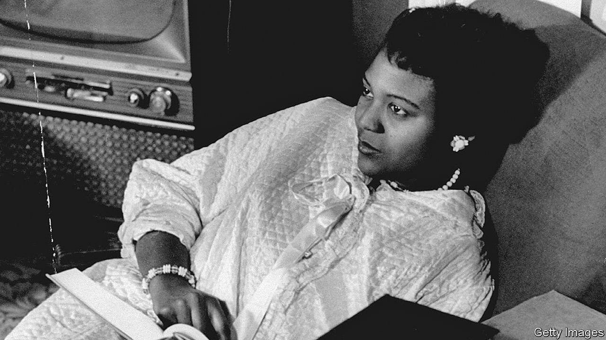

# D770 Autherine Lucy was an unlikely pioneer
> **desegregation：废除种族隔离；反隔离**
 > 

1 Friday february 3rd 1956 was one of those **cold-misty** mornings in **Tuscaloosa**, Alabama. Autherine Lucy needed her umbrella, as well as her hat, to walk into her first class at the University of Alabama. She had been driven by her best friend, Pollie Anne Hudson, the 60 miles from Birmingham. Under her raincoat she was wearing her best heels and a peach dress, a good **pastel** colour to be **inconspicuous** in, because she had no intention of causing a **fuss**. All she wanted was to finish her education in the best place in the state. When she pictured herself among those red-brick Greek-revival buildings, she would think: “Girl, you’ve got great aspirations!” But why not? She could blend quietly in and study to become a **librarian**. No one should mind. What was harder to hide that Friday was that a lawyer had come with her, a university policeman was close behind her, and her skin was black.

> **misty**：薄雾笼罩的；模糊的
>
> **tuscaloosa**：塔斯卡卢萨
>
> **pastel** :彩色粉笔；蜡笔
>
> **inconspicuous**: 不引人注目的；不起眼的
>
> **fuss**:大惊小怪；无谓的激动（或忧虑、活动）；（为小事）大吵大闹
>
> **librarian**:图书管理员；图书馆馆长
>

2 The law was on her side; in 1954, in Brown v Board of Education, the Supreme Court had ruled that public schools and colleges could not discriminate by race. But the **deep South** had **dug in.** By 1956 no African-American, male or female, had yet been admitted to any white public school or university in Alabama. She was the first, arriving just as a bus boycott by black passengers in **Montgomery** was putting the whole state on edge. This was why she was **apprehensive**, as she walked on with her handbag dangling clumsily from her arm. She was the first, and she was the only one.

> deep South:深南部, 美国南部诸州（尤指佐治亚、亚拉巴马、密西西比、路易斯安那和南卡罗来纳州）
>
> **dig in**:苦干；坚持主张
>
> **Montgomery**: 蒙哥马利县
>
> **apprehensive**:忧虑的；担心的
>
> **Put...on edge**:令不安或惊恐
>

3 That had not been the plan. She was meant to enter with Pollie Anne, who had decided that they should apply to **ua** together. Two young black women graduates would take on the all-white state establishment. It sounded like a joke, but Pollie Anne, who was in the **youth chapter** of the **naacp**, was so extrovert and forceful that Autherine could only go along. In 1952 they both applied and were accepted, until the dean discovered they were black and they were unacceptable again.

> **youth chapter**:青年团
>
> **naacp**:全国有色人种协进会（美国一黑人人权组织）
>

4 The whole thing could have ended there, and part of her wished it had. But the naacp took up their case, as did two **top-flight** lawyers, Arthur Stores (the lawyer in the car with her) and Thurgood Marshall, who in 1967 became the first black justice on the Supreme Court. For three years they built a case against ua, which the Brown ruling made **unassailable**. The university managed to ban Pollie Anne, because she had been pregnant out of **wedlock** when she applied, which was against the rules. It could find no dirt on Autherine, so it had to let her in.

> **unassailable**:无法摧毁的；无懈可击
>
> **top-flight** :第一流的；最高档的；最佳的
>
> **wedlock**:婚姻;已婚状态
>

5 Her parents deeply disapproved of this campaign. Her father was a **sharecropper**, working hard to feed a **brood of** ten children by making axe handles and baskets as well as picking cotton. He told the newspapers that he had raised his youngest daughter to know better. He himself respected white people, and always went to the back door; he feared for her safety if she acted otherwise. She too, an intensely shy, dreamy child who loved reading and always trailed behind in the cotton fields, was unsure that she wanted to be part of a national struggle. Even her name bothered her, that awful “Autherine”. She thought of changing it to Hilda, until someone told her that was a cow’s name. The naacp did not seem crazy about her either, and she **overheard** remarks that she and Pollie Anne were not the best or most scholarly candidates to head the fight. Day after day she prayed about it all, but in the end she decided that going to ua was what she had to do.

> **sharecropper**:佃农a farmer who gives part of his or her crop as rent to the owner of the land
>
> **brood** :一窝动物；一大家孩子
>
> **know better**:明白事理(而不致于…)；很明白(而不致于…)
>

6 So there she was, on that Friday, more than three years after she had applied to come. The first class was geography. When she went in, sitting in the centre of the front row with police still **hover**ing round the door, silence fell. Several students moved away, leaving her alone in the row. Most just stared, but a few were even friendly. The most hurtful thing was that she could not eat in the cafeteria or live in the dormitories with the other female students. She ate alone, and after classes was driven back to Birmingham.

> **hover**:盘旋；徘徊；犹豫
>

7 The second day, too, went pretty well. The nights were a different story, when male students and blue-collar Tuscaloosans burned crosses, waved **Confederate** flags, **chant**ed racist slogans and attacked black drivers in their cars. On February 6th that mob was waiting for her when she arrived, hurling eggs and stones and yelling for her to leave. **Huddling down** in terror she was driven from class to class, using the back doors, and in the end took refuge in the Bibb Graves Hall, where she stayed for hours. She actually thought she might die there, in the very building—with its huge library—where she had wanted to study for so long.

> **Confederate**:南部邦联的
>
> **chant**: 反复呼喊的话语；重复唱的歌词;吟唱；歌颂
>
> **huddle** :（通常因寒冷或害怕）挤在一起；缩成一团
>

8 She was rescued, but the university now had good safety reasons to suspend her. It swiftly did so, and attempts to build a new case against it **backfire**d so badly that she was expelled. This looked like the end of her academic career. She was now celebrated as a civil-rights pioneer, and for a few months she made speeches like an activist. But she was tired and **disheartened**, with no mind to **dwell** on hateful things. Besides, her heart was full of her new husband Hugh Foster, a **minister**, the growing family they had together and the need to keep moving from church to church, so she soon gave up all campaigning. The main legacy of her three days at ua was the difficulty, now she was famous or rather infamous, of getting a teaching job in the South.

> **backfire**: 回火；适得其反;产生事与愿违的不良（或危险）后果
>
> **disheartened**:灰心；沮丧；气馁的
>
> **dwell**:居住；栖身
>
> **minister**:牧师
>

9 In 1988, however, she was invited to give a history lecture there. A little later, she found that her **expulsion** had been **rescin**ded. Immediately she signed up for the graduate programme in education, and in 1992 received her master’s degree alongside her student daughter Grazia, who was graduating. She was given a standing ovation as she walked onstage, looking out this time not on **affront**ed stares but on smiles of genuine affection.

> **expulsion**:开除；驱逐
>
> **rescind**:撤销；废除
>
> **affront**:冒犯；侮辱
>

10 There was more. In 2010, a red-brick clock tower on campus; in 2019 an honorary doctorate. This year came an especially sweet moment, when the Bibb Graves Hall, where she had huddled and prayed and cried on that long-ago February day, listening to the rage outside, was renamed after her. Back then she had had no notion who Bibb Graves was. But besides being a two-time governor of Alabama, he was also a Grand Cyclops of the Ku Klux Klan.

