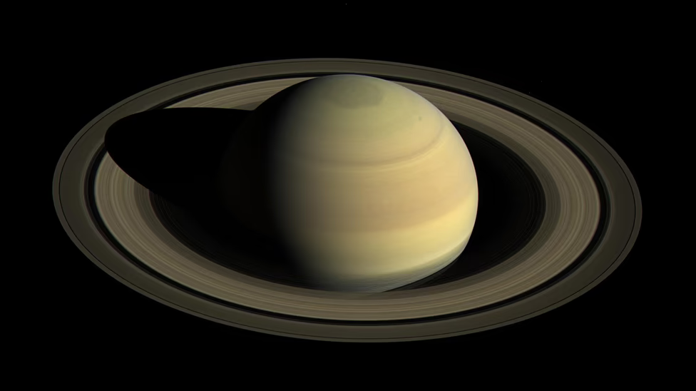

# D771 The Long Goodbye to Saturn’s Rings

1 Of all the planets in our solar system, Saturn might be the prettiest. Those rings! Strand after strand of icy material with just a hint of rock, arranged in a delicate halo. Up close, the rings gleam in soft pinks, grays, and browns, shimmering in the darkness. It’s hard to imagine Saturn without them.
But Saturn’s rings aren’t a permanent feature. In fact, they’re vanishing.
The rings are losing material every year. Incoming **micrometeorites** and the sun’s radiation disturb the small, dusty pieces of ring matter, **electrifying** them. The particles, suddenly transformed, become **attuned** to Saturn’s magnetic field lines and start spiraling along those invisible paths. When the particles get too close to the top of Saturn’s atmosphere, gravity pulls them in, and they vaporize in the planet’s clouds.

> **micrometeorite**：微小陨石
>
> **electrify**：电气化
>
> **attuned**：调(音)；使调和；适应；习惯
>

2 Astronomers call this “ring rain,” and over time this and other phenomena will **sap** the distinctive element that, to us, makes Saturn Saturn, until nothing is left. Right now? “This is us looking at Saturn’s rings in their **heyday**,” James O’Donoghue, a planetary scientist at JAXA, Japan’s space agency, told me. A magnificent sight that, from our perspective, seems **immutable**, but, on the grand scale of things, is fleeting.
It might help to know that the process is going to take a while: O’Donoghue and other scientists estimate that the rings will disappear in about 300 million years. The residents of Earth still have plenty of time to marvel at the beauty of Saturn’s rings, and to study them. Because, although astronomers understand that the rings are on the way out, they still don’t know everything about these bands—including how Saturn got them in the first place.

> **sap**：削弱；逐渐破坏
>
> **heyday**：全盛期
>
> **immutable**：不可改变的；永恒不变的
>
> **band**：带；波段
>

3 Saturn’s rings have **dazzled** observers for centuries, but we got truly close to them for the first time in the early 1980s, when NASA’s Voyager spacecraft **whizzed** past during a grand tour of the **outer planets**. At the time, scientists suspected that the rings probably formed alongside Saturn about 4.6 billion years ago, when the solar system was young and **boisterous**. Back then, with rocky objects flying around everywhere, a new planet could easily have captured some, **slung** them around its middle, and let gravity flatten them.

> **dazzle**：使倾倒
>
> **whizzed**：飕飕作声
>
> **Outer planet**：带外行星
>
> **boisterous**：喧闹的、欢腾的
>
> **sling**：扔；用悬带吊挂；吊起
>

4 But Voyager’s **flyby** suggested a different story. The observations captured the rings in greater detail than ever before, revealing that the system didn’t have as much mass as researchers had predicted, which meant that they couldn’t be billions of years old. The rings had to be much younger, perhaps only 10 million to 100 million years old. “Those results were totally puzzling and bizarre,” Jeff Cuzzi, a research scientist at NASA and an expert on planetary rings, told me.

> **flyby**：(飞机的)飞越定点区域; (航天器的)探测飞行
>

5  Saturn’s ring system had seemed as ancient as the solar system itself; now it seemed that the rings didn’t exist when dinosaurs began roaming the Earth. The solar system had quieted down by then, so where would Saturn have gotten the raw material? “The probability of an event forming the rings now”—now, in astronomer-speak, meaning within the past 100 million years or so—“is very unlikely,” Paul Estrada, a NASA research scientist who has studied Saturn’s rings for years, told me. And yet more recent observations support this hypothesis. In 2017, a NASA spacecraft called Cassini **skimmed** past Saturn’s rings, sending home as much information as possible before it was **obliterated** in the planet’s atmosphere. Its final measurements backed up what the Voyager missions had observed, that the rings weren’t massive enough to be ancient.

> **obliterate**：摧毁
>
> **skim**:滑过
>

6 The science community hasn’t come to a consensus about the origin story of Saturn’s rings. But, if the rings are indeed **cosmically** young, scientists say that they probably formed when one of Saturn’s moons, itself quite old, drew too close and was shredded to bits. The moon was likely a small one; our own moon, O’Donoghue said, could be used to fashion thousands of ring systems like Saturn’s.

> **cosmically**:大规模；按照宇宙法则
>
> **fashion** :塑造
>

7 The story of Saturn’s rings is a reminder that the worlds of our solar system, however still and **static** they might look from here, are dynamic places, with dramatic histories of their own. “We think that the universe out there—as opposed to this, where we live, where everything is chaotic and messy and changing all the time—is this kind of crystal and never-changing thing,” Cuzzi said. From **afar**, Saturn’s rings look so solid, like a ledge you could swing your legs over. But they are anything but. “Those particles are slowly **jostling** and bumping into each other,” Linda Spilker, a planetary scientist at NASA’s Jet Propulsion Laboratory who worked on the Cassini mission, told me. “There’s **wakes** created by tiny moons.” When Cassini dived between Saturn and the rings, “we could actually measure the amount of ring material flowing into the planet,” she said. The Voyager mission, which Spilker also worked on, had spotted some evidence of ring stuff leaking into Saturn, but with Cassini, astronomers could really investigate the phenomenon, and make their best estimates yet for how long the rings would stick around.

> **static**: 静止的；不变的
>
> **afar**: 遥远；由远方；在远处
>
> **jostle**: 挤；贴近；刺激；与…竞争
>
> **wake**： (船只或其他物体在水中前行时留下的) 尾波
>

8  A few hundred million years is a very long time. And yet I feel a particular **twinge** of sadness about the idea of Saturn losing its rings. So do some astronomers I’ve spoken with, and others who aren’t astronomers at all, but who grew up with a very clear picture of Saturn as a ringed planet. I felt similar **pangs of** emotion when I learned that the moon is slowly drifting away from Earth; that a tiny Mars helicopter tried to take flight in the red planet’s atmosphere; that an **interstellar** **comet** traveled for millions of years without feeling the warmth of a star. I’ve come to think of these reactions as “space feels.” None of these events has any real bearing on our daily lives, and yet they **tug** at the **heartstrings** in a cosmic way. “It’s very, very sad that the rings will disappear in the future,” O’Donoghue said. But “I’m very happy that we’re lucky enough to see it.”

> **twinge**：(通常指不快的)一阵强烈情感
>
> **pang**：突然的痛苦; 突然的剧痛
>
> **tug** :拉;一股强烈的感情
>
> **heartstring**:深切的爱（或同情）；心弦
>
> **interstellar**: 星际的
>
> **comet**: 彗星；扫帚星
>

9  Perhaps someday, after Saturn’s rings have **dissipated**, the universe might give the planet a new set. “Maybe through some process—another moon is broken apart, a comet comes in too close—and you start it all over again,” Spilker said. “Maybe this isn’t the last we’ll see of rings around Saturn.”

> **dissipate**：驱散、消散
>

10 After all, the cosmos is quite the jewelry designer; Jupiter, **Uranus**, and **Neptune** all have rings. They’re faint, **wispy** things, but they’re there, and they were probably much more **massive** long ago, before a mysterious mechanism shrunk them down, O’Donoghue said. Cosmic forces are already at work on the solar system’s next **addition**. Sometime between 20 million and 80 million years from now, **Phobo**s, a small moon of Mars, will likely break apart. The shards will swirl around the red planet, settling into a new, beautiful feature. Imagine Mars with rings.

> **Uranus**：天王星
>
> **Neptune**：海王星
>
> **wispy**：纤细的、脆弱的
>
> **addition**：扩建部分
>
> **Phobo**:火卫一
>

