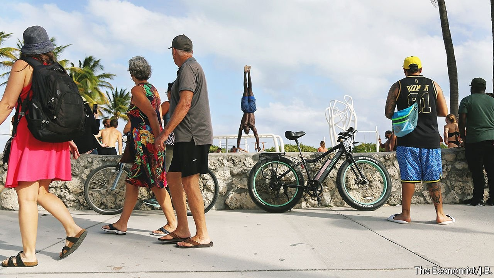
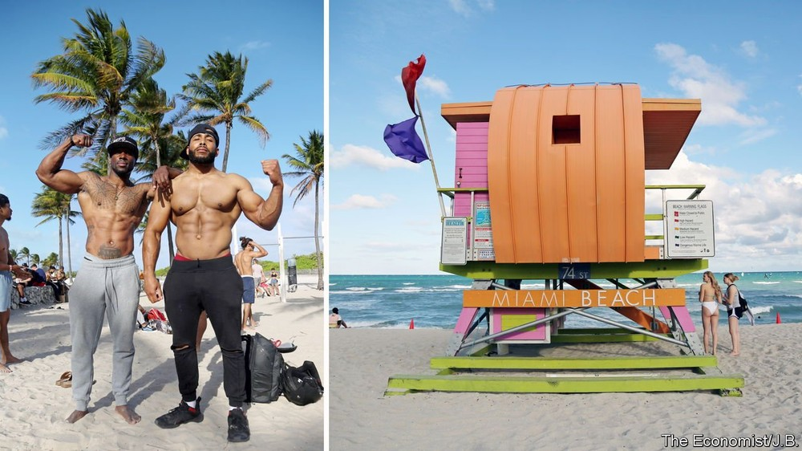
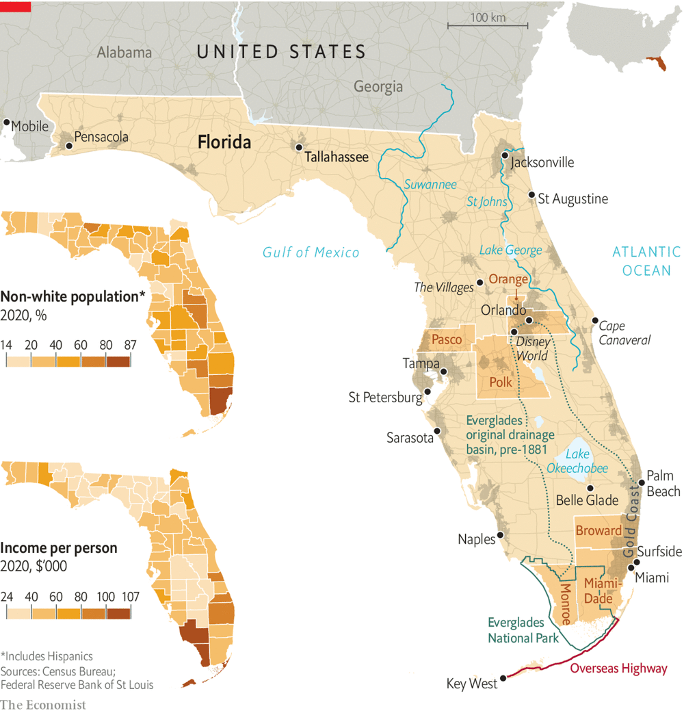
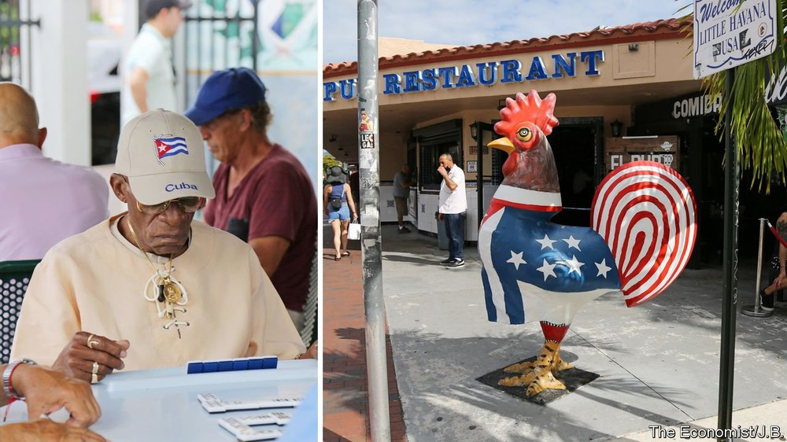
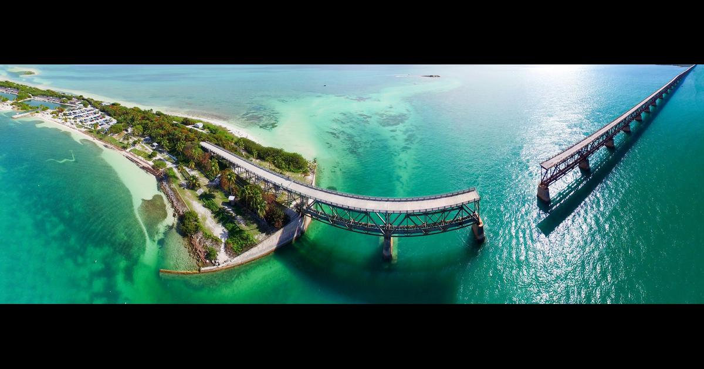
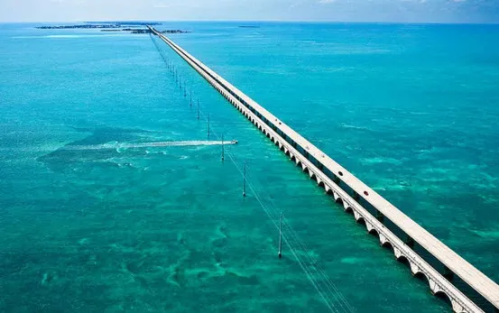

# D775-776 Like America, the Sunshine State also rises

1 To understand florida, drive south from Miami across the highway spans that arc over the glassy sea. A century ago, trains took a similar path, winding 153 miles (246km) down to Key West, the southernmost city in the continental United States. Crowned the “eighth wonder of the world” when it opened in 1912, the Overseas Railroad was the creation of Henry Flagler, a founder of Standard Oil who spent $50m building railways and hotels in Florida, equivalent to more than $1.6bn today.

2 In 1935 a hurricane destroyed most of the Overseas Railroad. But Floridians did not accept defeat. After feverish reconstruction, the route reopened as the Overseas Highway, one of the world’s longest overwater roads. Today, a handful of the original spans have been converted into piers for fishermen and paths for tourists. The Overseas Highway embodies a central feature of Florida: a persistent desire to reshape the environment and dominate an **inhospitable** land. In his book “Finding Florida”, T.D. Allman calls Florida “the **Play-Doh** State”: people have repeatedly taken the goo and moulded it to fit their dreams.

> **inhospitable**：不适于居住的；冷淡的；荒凉
>
> **pier**: （突入湖、河、海中的）码头
>
> **goo**:黏稠物质
>

3 Continental America’s southernmost state was once a peripheral destination for a few tourists and sun-seekers. Today it is crucial to the country’s future. Whereas America’s population growth has slowed sharply, Florida’s has boomed. Between 2010 and 2020 the state’s population grew by 15%, twice the national rate. Florida has overtaken New York as America’s third-most-populous state (after California and Texas). Some 22m people now call it home, and another 7m people are expected to do so by 2040. From 1940 to 2020, Florida’s population increased 11-fold. It leads the country in domestic migration and, six years ago, overtook California to become the top destination for foreigners moving to America.

4 Florida has now “challenged California to be America’s cultural and demographic **touchstone**”, writes the historian Gary Mormino in his forthcoming book “Dreams in the New Century”. The country’s political division can be spotted in images of Donald Trump **brooding on** his loss of the presidency in 2020 at his Mar-a-Lago golf course in Palm Beach and Ron DeSantis, Florida’s Republican governor and a presidential hopeful, **railing** against President Joe Biden’s covid-19 policies.

> **touchstone**：试金石；检验标准
>
> **brood on** :念念不忘，计较
>
> **brood**: 焦虑；孵（蛋）;沉思
>
> **rail**：责骂；怒斥；抱怨
>
> verb late Middle English: from French railler, from Provençal ralhar ‘to jest’, based on an alteration of Latin rugire ‘to bellow’.
>

5 Most people looking at Florida see either sunshine or shadows: a tax- and regulation-light recipe for national success, or a **cautionary tale** of a **short-termist** society that has ignored long-term vulnerabilities. The collapse last year of a **condominium** tower in Surfside, which killed 98 people, had a tragic, Floridian edge, born of neglect and short-term savings against long-term sustainability and lack of oversight. As the state with the longest coastline in continental America, Florida faces an **existential** threat from sea-level rise, but has failed to prepare itself for the consequences.

> **short-termist** :短视；短期主义者
>
> **condominium** :公寓
>
> **cautionary tale** :警世故事
>
> **existential** :关于人类存在的
>
> **oversight**: 监督；监管
>

6 Florida’s prominence is new. St Augustine on its Atlantic coast is America’s oldest permanent European settlement, dating from 1565. But Florida was long the country’s last **frontier**, a vast **swathe** of rural swampland where settlers lived in obscurity and poverty. “Florida, sir, is not worth buying,” declared John Randolph, a Virginia congressman, during a debate in 1845 about whether to admit it as America’s 27th state. He called it “a land of **swamp**s, of **quagmire**s, of frogs and alligators and mosquitoes”, and predicted that, “No man would immigrate into Florida, no, not from hell itself.”

> **swathe[sweɪð]**：一长条田地；一长片
>
> **Swath/swɒθ/** : 细长的列
>
> **frontier**:前线；边境；边界
>
> **swamp**:沼泽
>
> **quagmire**：泥沼；湿地；
>

7 For decades Mr Randolph seemed right. A few daring transplants such as Flagler may have worked to alter Florida’s geography and its appeal by building coastal luxury hotels such as The Breakers in Palm Beach. But it was only a century ago, in 1922, that the state passed the milestone of 1m residents. Until the second world war, Florida remained the smallest state in the South by population.

8 Technology then changed everything. **Dredg**ing and in-filling turned swampland into less soggy settlements. The spread of railways, highways and commercial air travel ferried tourists south. Air-conditioning made Florida more tolerable, as did ddt, an insecticide that waged war on mosquitoes (with **far-reaching** environmental damage). Conflict also played a part. During the second world war, 2m servicemen trained at Florida’s military bases and liked what they saw; many returned in peacetime.

> **dredge**：疏通处理
>
> **far-reaching**：影响深远的；广泛的
>

9 Offering warmth and low cost (Florida is one of seven states to levy no income tax), the Sunshine State is a famous magnet for retirees. Covid-19 and work-from-home policies have increased and broadened its appeal. By opposing mask requirements and vaccine mandates and making schools stay open, Mr DeSantis has positioned Florida as what he calls the “freest state in these United States”, in contrast to Democratic-led states such as New York and California that required masks and vaccines and kept businesses and schools closed for longer.

10 More young professionals and families with flexible jobs have migrated to the state, as have some financial firms from New York. Florida was once a “carrot at the end of the life well lived, but that’s not true any more”, says Chris Sprowls, the Republican speaker of the state House of Representatives. Now “people are coming here to raise families” and work, he says. Mr Sprowls sees recent immigration as a validation of Florida’s policies. “We’re a blueprint for the country,” he claims.

> D755 截止处（暂定）
>
> Southern stinginess
>

---

11 Florida has the lowest number of government employees per head of all 50 states. State spending per citizen is also the lowest in America, at $3,845, 40% less than the average. (This excludes federal spending, and with one-fifth of Floridians over 65, many rely on Social Security pensions and Medicare, federal health care for the elderly.) Tax cuts are a favourite topic of conversation among Floridian politicians. “Our taxes should actually go down every year,” says Rick Scott, a former governor who boasts of using his eight years in office to cut taxes 100 times and to **scrap** 5,000 regulations. “If you look at the number of people who move to a state like Florida every year, shouldn’t we be able to share the cost of government with everybody?” he asks.

> **scrap**：废弃；取消
>

12 The state is also extremely diverse, with one-fifth of its population born outside America, earning it the label of “southern **Ellis Island**”. Even those born in America often **hail from** elsewhere, evident in a **panoply** of licence plates. As many as 39% of Floridians are from another state, against 16% of Californians and 22% of Texans. Steve Schale, a Democratic strategist in Tallahassee, the state capital, says that Florida is “not really a state” at all. In most states residents share common experiences, but that is not true in Florida, he argues, since so many people import their biases, voting records and cultural **affinitie**s from elsewhere. “Other than sunshine, there’s no connective tissue that defines Florida,” says Joe Hamilton, founder of the St Pete Catalyst, an online news site. Aesthetically, the state is also diverse, except for one characteristic: flatness. The tallest “hills” in the state are its **overwater** bridges. At just 345 feet (105 metres), Florida’s highest natural point is equivalent to a 32-storey building.

> **Ellis Island**：埃利斯岛（美国纽约市附近的小岛，1892 至 1943 年间是美国的移民检查站）
>
> **hail from** ：出生于；来自于
>
> **panoply**：巨大的数量（或收藏品）
>
> **affinitie**：类同；喜好；密切的关系
>

13 This correspondent drove the length of Florida: from Mobile in Alabama to Pensacola in western Florida, across the central corridor, and down both coasts, all the way to Key West. One way to see the state is as an **eclectic** necklace, with beads of various sizes and materials strung together in an incoherent arrangement.
The northern **panhandle** is the most “southern” part of Florida, with the largest black population. It resembles Alabama and Georgia, and its people’s **drawl** sounds southern. The choice of **Tallahassee** as state capital feels **anachronistic**, from a time when most of the population lived in the north, cotton was a power crop and slavery was accepted. (Florida fought for the Confederacy.) As if to reinforce the panhandle’s **idiosyncrasy**, part is so far west as to be in a different time zone, lagging the rest of the state by an hour.

> **Eclectric**: 不拘一格的，兼收并蓄的
>
> **panhandle**：狭长地带；
>
> **drawl** ：拖拖沓沓地说[唱](出)
>
> **Tallahassee**：塔拉哈西市 capital of Florida
>
> **anachronistic**：过时的；落伍的；不合时宜
>
> **idiosyncrasy**: (个人特有的）习性, 特征, 癖好
>

14 Central Florida is where the old state meets the new. This is farmland and cow country, but also home to fast-growing counties and to the fourth-largest city, Orlando. The Villages, a largely white retirement community that restricts how long children can visit and is sometimes called “Disney World for retirees” is here, an hour’s drive north-west of the actual Disney World. A 90-minute drive south is Polk County, home to a rapidly expanding Puerto Rican population.

15 The east and west coasts share beaches and water but have different micro-cultures. On the west are buzzing cities like St Petersburg, Tampa and Sarasota, which are younger and more affordable than far-south Naples, which merits its catchphrase of “I never felt so young and poor until I moved to Naples.” The west coast has more Midwesterners and is slower-paced than the east. The east has the Space Coast around Cape Canaveral, an industry that is mostly a low-orbiting sector with touristic appeal, as well as the Gold Coast stretching from Palm Beach to Miami.

16 Miami is a world in itself, one of the most global cities in America, with a strong Cuban influence. It is reinventing itself as a commercial hub. Southern Florida is the engine of the state economy. The state has 67 counties, but the four that make up southern Florida (Broward, Miami-Dade, Monroe and Palm Beach) contribute a third of gdp. The south has two of the four wealthiest zip codes in America (Miami Beach and Palm Beach). Yet an hour’s drive into the Everglades is Belle Glade, Florida’s poorest city, a postcard of despair. The Everglades serves as a reminder of the scrub, mangroves and swamps that explorers encountered in the 16th century. But half the Everglades is now gone, drained and filled in for development.

17 Florida is worth trying to understand for two big reasons. First, it is a window into the wider challenges facing America. It has a powerful seniors’ **lobby** but also a growing, dynamic group of minorities, including Hispanics, who account for more than a quarter of the population. “We look more like the us at large than any other state,” says Susan MacManus, a professor emerita at the University of South Florida. As America ages and becomes more diverse, Florida may offer lessons for the entire country.

> **lobby**：（就某议题企图影响从政者的）游说团体a group of people who try to influence politicians on a particular issue
>

18 Second, Florida influences the whole country both economically and politically, especially as more people move in. Like California and Texas, Florida is already shaping the nation, with innovative policies that are copied elsewhere. After the 2020 census, Florida picked up a congressional seat and an electoral vote. It now has more than a tenth of the 270 electoral votes needed to win the presidency. And it is by far America’s largest swing state.

19 Indeed, Florida’s voters are predictive of American politics, exposing its stark divisions. In the 12 presidential elections since 1976, Floridians have voted four times for Democrats, eight times for Republicans, and all but twice for the winner. Yet most races were extremely close—typified by the 2000 “hanging-chad” election that gripped the world. Adding up the ballots for every presidential election from 1992 to 2016, the results in Florida were separated by less than 20,000 votes, or 0.04%. The strong performance of Mr Trump in 2020 widened the **cumulative gap** to 354,000 votes, but that still represented a **margin** of only 0.6%.

> **stark**:明显的，鲜明的
>
> **cumulative**：聚积的；累计的；累积的
>
> **margin**：差额
>

20 This special report will analyse the Sunshine State from different angles, including the economy, public policy, migration, politics and the environment. An animating theme is Florida’s fragility, but also its rise and growing importance. “The way Florida goes, the way the country goes,” says Annette Taddeo, a Democratic state senator who is running for governor. What happens in Florida, in short, **reverberates** around the country. ■

> **animate**:有生命的；有活力的
>
> **reverberate** :回荡；有长久深刻的影响
>

