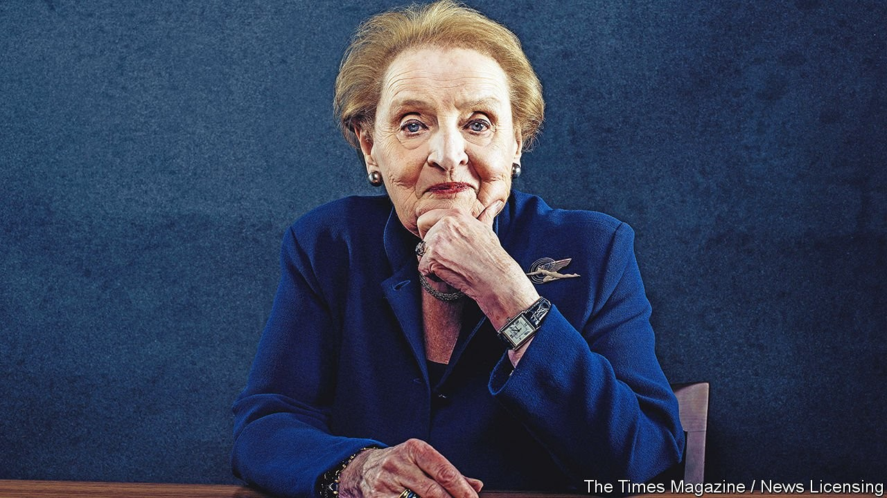

# D777 Madeleine Albright saw herself as an ambassador for freedom

1 Whenever she was asked what advantages a woman brought to the running of foreign policy, Madeleine Albright had several answers. Women disliked **head-on** arguments; they preferred to sit down and talk things through. Men focused on power and position, dangerous obsessions; women focused on almost anything but that. And, being so small a minority in that men’s world, they got noticed more. She herself, short, round and blonde, was instantly recognisable the world over, and enjoyed making herself more so. When she accused Fidel Castro’s **operatives** of having no **cojones**, or called Slobodan Milosevic of **Serbia** a murderer, people were more startled than if a man had said it. A streak of aggression in a woman **went a long way**. So did sheer **pizzazz**. When she was nominated as secretary of state by President Bill Clinton in 1996 she wore a bright red outfit and a pearl necklace with an eagle **pendant**, both of which advertised her pride and joy far better than boring black could.

> **head-on**：正面的 (冲突或争执)
>
> **operative**：特工人员（美国英语）
>
> **conjones**：<非正式，美>睾丸；<喻>勇气
>
> **Serbia**：塞尔维亚
>
> **pizzazz**：激情; 活力; 时髦 [非正式]
>
> **pendant**：坠饰; 挂件
>
> **go a long way**：大有帮助
>

2 Her brooches and pins were another subtle **gambit** men did not have. She took up this delightful **pastime** when she was America’s ambassador to the un from 1993 to 1997: at first the only woman on the Security Council, one skirt among 14 suits. On happy days she wore flowers, butterflies or balloons; on bad days, crabs and carnivores. When the Iraqis called her an “unparalleled serpent”, a tag she **revelled** in, she pinned on a snake. When the Russians **wired** her conference room she wore a huge bug, just to let them know she knew. If she wanted to divert press interest from delicate talks, she sported a mushroom pin to make the point that some things did better in the dark.

> **gambit**： 占先的策略、开场白
>
> **pastime**：消遣
>
> **herbivore**：食草动物
>
> **carnivore**: 食肉动物
>
> **omnivore**：杂食动物
>
> **cannibal**：吃同类的
>
> **revel in**：陶醉; 沉湎
>
> **wire**： 在…里装设电线
>
> **sport**：（引人注目地）穿戴
>

3 Nonetheless, she also keenly felt a woman’s disadvantages. As professor of diplomacy at Georgetown University she urged her female students to interrupt and speak up, but she herself sometimes felt **a squirm of** fear when she **butted into** a debate among men. Inevitably career and family clashed, too. Even as she accumulated degrees and expertise, she wanted to be a good mother and a dutiful wife. When her husband, Joseph Albright, the **scion** of a wealthy newspaper family, left her in her 40s, calling her too old-looking, she wanted him back so badly that she was prepared to abandon any thought of a career.

> **a squirm of**：to feel or display discomfort or distress
>
> **butt into： **干涉;插手
>
> **scion[ˈsaɪən]**：(名门望族的)子孙 [文学性]
>

4 In the end, however, that career saved her. The world, its troubles and their possible solutions were utterly **absorbing**; she could have stayed at **Foggy Bottom** for ever. In a sense, she had already been trained for it. Her father, her chief model and adviser, had been the Czech ambassador in **Belgrade**; the family had been forced first by Nazis and then by Communists to abandon Czechoslovakia and make their way, slowly, to America. They arrived in 1948, when she was 11 and, already, a citizen of the world. She worked hard at becoming “thoroughly American Maddy”, until she **dreaded** that her parents might do something European in front of her friends, such as serving cabbage rolls or singing Slovak songs. America was a haven of peace, democracy and freedom which she keenly embraced and never **took for granted.**

> **absorbing**：让人专注的、引人入胜的
>
> **Foggy Bottom**：雾谷；美国国务院
>
> **Belgrade**：贝尔格莱德
>
> **dread**：恐惧、害怕、担心
>

5 Her approach to foreign policy flowed naturally from this. She wanted to give freedom and democracy to everyone. Yet America’s power to lead was so morally important that it could not be **squandered** on risky **enterprises**. As secretary of state she fostered European alliances that could carry some of the burden, and expanded nato’s umbrella to cover the new democracies emerging from the Soviet **rubble**. (Eastward expansion was a step towards Russia, she insisted, not against it.) Her loathing for Donald Trump, when he appeared, was part-based on his **disdain** for these alliances, which included the places of her past.

> **squander**：浪费
>
> **rubble**：瓦砾
>
> **enterprise**：事业
>
> **disdain**：蔑视；鄙视
>

6 Her years at the State Department, from 1997 to 2001, were relatively quiet. It had not been so at the un, where Somalia, Rwanda and Bosnia were all traumatic for her. In Somalia, where **anarchy** reigned, America sent in troops to feed the hungry but, when 18 were killed, felt humiliated and withdrew. In Bosnia, **convulse**d with ethnic cleansing, America stood by for far too long until limited nato air strikes cleared the way for a negotiated peace. As for Rwanda, it exploded in 1994 with such volcanic intensity that she received no intelligence and nothing could be done. She argued hard for humanitarian aid but it was too late even for that, and no one, least of all Congress, seemed to care. Working at the un left her in two minds: first, that it was wonderful that such a body existed; but second, that it was a **monstrous** bureaucracy which, while people were dying, argued over commas.

> **anarchy**：无政府状态；混乱，无秩序
>
> **convulse**：使震动；震撼、 抽搐
>
> **monstrous** ：畸形的；恶毒的
>

7 Failure in Rwanda was her deepest regret. Having **huddled** through the London Blitz, she knew something of war, but not like this: children’s skulls **gouge**d by **machete**s, stadiums carpeted with blood. Another vivid cause for regret was her remark on “60 Minutes” that the deaths of half a million Iraqi children, supposedly caused by the sanctions placed on Saddam Hussein for blocking un nuclear inspections, were a price worth paying. The figures turned out to be false, but she hated to appear so cruel.

> **huddle**：蜷缩
>
> **gouge**：凿击
>
> **machete[məˈʃeti]**：大砍刀
>

8 The fighting in Yugoslavia touched her most closely. First, she had lived there. But second, it raised again the **spectre** of concentration camps in Europe, into which Muslim men and boys were herded to be starved or killed by **Serbs**. By that date she had also learned, to her horror, that 26 members of her own family had been murdered in **Terezin** and **Auschwitz**, including three grandparents. She found two of their names on the wall of the Pinkas **synagogue** in Prague, which she had visited before without knowing. Her parents had wiped that Jewish heritage away, and had her **baptise**d a Catholic, in order to escape such persecution.

> **spectre**：(对某事可能会发生而产生的) 萦绕心头的恐惧
>
> **Serbs**：塞尔维亚人（Serb 的复数）
>
> **Terezin**：泰雷津
>
> **Auschwitz**：奥斯维辛
>
> **synagogue**：犹太教堂
>
> **baptise**：受洗
>
> Names of 77,297 Jewish victims from Bohemia and Moravia are inscribed on the walls of the Pinkas Synagogue in Prague
>

9 She accepted this astonishing truth just after becoming secretary of state. It shocked her, but she stayed an **Episcopalian**, as she had become to marry Joe, and did not exploit her new identity. Her **overwhelming response** was to praise and defend what her parents had done for her. Yes, they had lied, and had deprived her of part of herself. But they had enabled her to live, succeed and be an American, the luckiest thing in the world.

> **Episcopalian/ɪˌpɪskəˈpeɪlɪən/**：新教圣公会的 [ADJ n]
>
> **overwhelming response**：强烈/过度的反应
>

