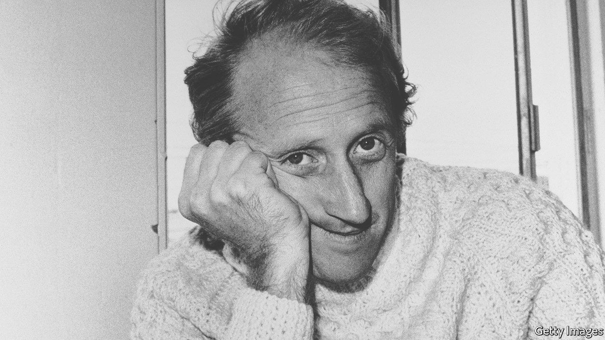

# D778 Stewart Brand’s belief in technology helped shape Silicon Valley

1 Only one person may be able to claim credit for the popularity of both the Grateful Dead and space colonisation: Stewart Brand. He is best known as the founder of the Whole Earth Catalog (pictured below), a **compendium** of tools that listed everything from **compost** machines to geometry books. Part do-it-yourself guide, part techno-Utopian journal, the periodical was considered essential reading by Americans who wanted to live more sustainably in the 1960s and 1970s. Many of its once-radical ideas, such as using solar panels, are mainstream today. In 2005 Steve Jobs, the late boss of Apple, called Mr Brand’s catalogue “one of the bibles of my generation.” In a new biography, John Markoff, a former technology writer at the New York Times, reveals that there is more to Mr Brand than the Catalog.

> **Grateful Dead**：一支摇滚乐队
>
> **compendium**： 概略、纲要
>
> **compost**：堆肥、(用于在盆中种种子和植物的) 特制土
>

2 Born to a wealthy family in Illinois in 1938, Mr Brand moved to the Bay Area to study biology at Stanford University. He quickly **fell in with** the Beat poets and, on returning to California after a brief **stint** in the army, met Ken Kesey and his Merry Pranksters, a **troupe** of acid-loving hippies. Mr Brand was at the heart of the emerging **counterculture**. In 1966 he organised the Trips Festival, an experimental, three-day event featuring a performance by the Grateful Dead, then an emerging rock band, and plenty of LSD. It was, as Mr Markoff describes, “the first time the Bay Area’s ten thousand hippies realised that there were ten thousand hippies.” By bringing free-spirited Californians together, the festival came to symbolise the start of flower power. Mr Brand’s ability to unite individuals and **galvanise** movements became a **hallmark** of his career and explains his towering influence on many of the Golden State’s subcultures.

> **fall in with**：偶然遇到、碰见
>
> **Beat poets**: 垮掉派诗人
>
> **stint**： 一段时间
>
> **troupe**[truːp]：剧团 troop
>
> **counterculture**：反主流文化（60和70年代美国青少年中盛行的一种思想）
>
> **Flower power**：花之力（20 世纪 60 年代和 70 年代初期年轻人信奉爱与和平、反对战争的文化取向）the culture connected with young people of the 1960s and early 1970s who believed in love and peace and were against war.
>
> **galvanize：激励；刺激**
>
> **hallmark**：标志; 特征
>
> **Golden State**：（美）加利福尼亚州的别名
>

3 The Catalog, first published in 1968, became a kind of manifesto for the several thousand Americans building **communes**. Those who wanted to live self-sufficiently off the land needed access to tools to survive; Mr Brand’s publication provided them. The black-and-white pages packed full of agricultural equipment and how-to diagrams won both America’s National Book Award in 1972 and a **cult** following, particularly among environmentalists. Meanwhile Mr Brand’s belief in tools as a “democratising” force was strengthened, explains Mr Markoff. The man who hung out with Mr Kesey had become a “**technophile**”.

> **commune**：群居团体
>
> **cult**：崇拜；受特定群体欢迎的
>
> **technophile**：技术爱好者
>
> **phile**: 爱好……的人，……爱好者
>

4 Mr Brand, who was also a journalist, mingled with early computer pioneers. He helped Douglas Englebart, an inventor, demonstrate the computer mouse to the world. In 1972 he and Annie Leibovitz, a photographer, documented the engineers of the first modern personal computer at Xerox’s PARC laboratory for Rolling Stone magazine. A few years later Mr Brand became the first journalist to use the phrase “personal computer” (by then he had discontinued the Catalog amid deepening depression) and went on to found the Hackers Conference in 1984, a **pivotal** moment for the open-source philosophy responsible for much of modern software.

> **pivotal** ：关键性的；核心的
>

5 Mr Brand’s **technophilia** helped shape Silicon Valley. But it **drove a wedge between** him and his ecologically minded friends. He had always been an outlier, enjoying Ayn Rand’s libertarian books at university. His fascination with humans settling in space—he financed the subject’s first major conference in 1974—widened the divide. In 2009 Mr Brand **distanced** himself from his fellow environmentalists, advocating for **genetically modified organism**s and nuclear power. As for the eco-warriors, he labelled them “irrational, anti-scientific and very harmful”. In response George Monbiot, an activist, suggested that Mr Brand was a spokesperson for the fossil-fuel industry. The criticism echoed Mr Kesey’s remark decades earlier: “Stewart recognises power. And cleaves to it.”

> **technophilia**：技术狂热者
>
> **drive a wedge between**：破坏关系
>
> **distance**：疏远
>
> **genetically modified organism**：转基因组织/生物
>
> **cleave to**：坚持、坚忠于 [正式]
>

6 Mr Markoff’s book is dense and often mirrors the Catalog’s chaotic structure; it jumps between time periods in a way that, at times, makes it difficult to follow the narrative of Mr Brand’s life. “We Are As Gods”, a forthcoming documentary about the tech visionary, is sharper. Produced by the publishing division of Stripe, a Silicon Valley payments company, it **dwells on** Mr Brand’s attempt to build a clock that will last for 10,000 years—an effort to encourage humans to think more deeply about the future—on Jeff Bezos’s vast **ranch** in Texas. It also explores Mr Brand’s ambitious endeavour to bring mammoths back from extinction by genetically modifying elephants. To Mr Brand, this is a new form of conservation. To his critics, it is **hubristic**.

> **ranch**： (尤指饲养牛、马或羊的) 大牧场
>
> **hubristic**：傲慢的，excessively proud or self-confident.
>
> **dwell on**：详细讲述
>

7 The documentary’s focus on **outlandish** projects amplifies the biggest criticism of Mr Brand—that he may be too optimistic about technology and too neglectful of its risks. It derives its title from the Catalog’s opening sentence: “We are as gods and might as well get good at it.” Peter Coyote, a longtime acquaintance of Mr Brand who partied at the Trips Festival decades earlier, offers an alternative characterisation of humanity: “idiot **savants**”.

> **outlandish**: 古怪的; 极不寻常的; 奇特的
>
> **idiot savant**：低能特才(者)
>
> **savant**: 博学之士；学者；专家
>

