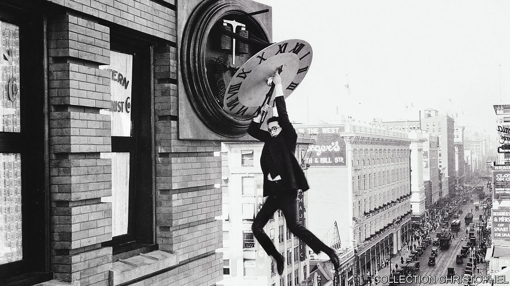
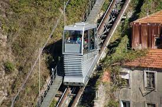

# D780 When Albert Einstein and Henri Bergson rowed about time

1 A century ago, on April 6th 1922, the world’s most famous philosopher debated against the most famous physicist and lost. Henri Bergson, a French thinker who caused Broadway’s first traffic jam when he gave a lecture in New York, had challenged the notion of time advanced by Albert Einstein, the discoverer of relativity. Bergson was putting his thoughts into book form when Einstein came to Paris.

2 At a gathering hosted by the Société française de philosophie, which followed a talk by Einstein on relativity, they finally locked horns. Bergson summarised part of his forthcoming book, “Duration and Simultaneity”. Einstein’s rebuttal was withering. There is “no such thing as a philosopher’s time”, he asserted. Bergson’s version of it was merely “psychological time”. Their stilted “non-conversation” was a “major anticlimax”, says Elie During, a (living) French philosopher. Bergson’s reputation waned; Time magazine named Einstein its “person of the century”.
Professional society founded by Xavier Léon in 1901

> **locked horns**：争吵，就拆在一起相斗，争论不休，难解难分地争斗
>
> **rebuttal**：反驳
>
> **withering**： 刻薄的; 令人难堪的
>
> **stilted**： (言谈)呆板的; 不自然的
>
> **anticlimax**：令人扫兴的结局
>

3 **Lopsided** though the contest was, philosophers and scientists still ponder it. At stake is not just the momentous question of what time is. The debate was a key event in the separation of sciences and humanities into what C.P. Snow, a British novelist, later called “two cultures”. Einstein saw science as “the ultimate **arbiter** of truth”, says Jimena Canales, author of “The Physicist and the Philosopher”, a book about the episode. Bergson insisted that science did not have the last word. Their clash, Ms Canales says, raised the question, “What is the relation between the subjective and the objective, and can we have a form of knowledge that includes both?”

> **Lopsided**：向一侧倾斜的；不平衡的
>
> **arbiter**：决定者；权威人士
>

4 The philosopher was in the time business long before the physicist. Bergson published his first book, “Time and Free Will”, in 1889, when Einstein was ten years old. Initially an adherent of the idea that the world works like a machine, in the course of investigating evolution he encountered what he came to regard as science’s mistaken notion of time.

> **Time and Free Will**：时间与自由意志
>

5 This views time in terms of space: an hour measures one-twenty-fourth of the Earth’s rotation. While useful, clock time misses what is most important about time, Bergson decided, namely “duration”. Rather than being disconnected from the past, the way one point on a ruler is separated from another, the present is **suffuse**d with it. Music is an example: each instant consists not only of itself but of what came before it. “Pure duration is the form that the succession of our states of consciousness adopts when the self lets itself live, when it stops establishing a separation between its present and former states,” Bergson wrote.

> **suffuse**：布满；弥漫于；充满
>

6 The passage of time—the present **billowed** with the past—provides escape from a clockwork universe. This approach does not deny the importance of matter, but places life partially outside it. It is duration that permits novelty, both in the life forms that emerge from evolution and in the acts that proceed from the exercise of free will. Bergson applied his most famous **epithet** to life’s struggle with the material world, with which it is also **bound up**: élan vital. People’s very identities are the “temporal synthesis that is duration”, as Mark Sinclair puts it in a recent book on Bergson.

> **billowed with**：在风中鼓胀着飘动
>
> **clockwork**： 装有发条的；重复的；可预测的
>
> **epithet**：绰号
>
> **bound up**：紧紧束缚在……里
>

7 His ideas were hugely influential. The literature of his day **teems with** Bergsonian characters, living between durational and clockwork worlds. T.S. Eliot (who heard him speak) seems to **lament** the **splaying** of time in space in “The Love Song of J. Alfred Prufrock”, writing of the evening “spread out against the sky/Like a patient **etherised** upon a table”. For the narrator of “In Search of Lost Time”, the memories awakened by a **madeleine’s** taste are enough to abolish clock time. Bergson married a cousin of Marcel Proust, the novel’s author, who was **best man** at his wedding. A **spellbinding** writer himself, Bergson won the Nobel prize in literature in 1927.

> **teem with**：充满
>
> **lament** ：痛惜；悲叹；对…表示失望
>
> **splay**：(物体的多个末端)向外张开; 使...向外张开
>
> **etherise**：使某人麻醉
>
> **madeleine**：玛德琳蛋糕; 别致的小松糕
>
> **best man** ：伴郎
>
> **spellbinding** ：引人入胜的
>

8 Even before his **showdown** with Einstein, though, Bergson was mocked for **purvey**ing metaphysical mumbo-jumbo. His **exaltation** of intuition, the faculty through which duration is apprehended, over intellect provided a fat target for Bertrand Russell, a British logician. According to Russell, writing in 1912, Bergson thought that the universe was “a vast **funicular** railway, in which life is the train that goes up, and matter the train that goes down.” Like advertising men Bergson relied upon “**picturesque** and varied statement”. In his “History of Western Philosophy” (1945), Russell added that the **irrationalism** of Bergson’s philosophy “harmonised easily with the movement which **culminate**d in Vichy”—a brutal comment about a Jew who refused special treatment from the Nazi-backed regime.

> **showdown**：决战
>
> **purvey**：提供 [正式]
>
> **exaltation**：提高；兴奋；
>
> **mumbo-jumbo**：繁文缛节、晦涩难懂的话、废话
>
> **funicular** ：缆索铁路
>
> **picturesque** ：优美的；古色古香的；生动的；栩栩如生的
>
> **irrationalism** ：非理性思想；非(反)理性主义
>
> **culminate**：达到顶点
>
> **Time present, past and future**
>

9 Einstein and Bergson were a study in contrasts. The German-born physicist was a **pacifist** and, until just before his death, a meat-eater; Bergson found philosophical grounds for France’s role in the first world war—and was a vegetarian. Their clash in **Paris** was principally over Einstein’s special theory of relativity, which had supplanted the **unvarying** time of Isaac Newton’s physics.

> **a study in**：典型案例(His face was a study in fear.)
>
> **pacifist** ：和平主义者
>
> **supplant**：取代
>
> **unvarying**：恒久的
>

10 Relativity states that time flows at different rates—faster or slower—for observers moving with respect to each other, as most do. Space compresses too, with the result that simultaneity is not absolute. This means that, in general, distinct observers witness events separated in space in different orders. Time and space blur together in a way implying that the past and future may be as real as the present, just as the Moon is as real as the Earth, a view sometimes called “**eternalism**”. The “distinction between past, present and future is only a stubbornly persistent illusion”, Einstein famously wrote.

> **eternalism**：永恒主义
>

11 This was a **frontal** challenge to Bergson’s central idea. “If time”, he wrote, “is thus spread out in space…it takes account neither of what is essential to succession nor of duration **in so far as** it flows.” Bergson did not deny Einstein’s discoveries; philosophy must be “constantly verified by contact with the **positive science**s”, he **averred**. But he maintained that relativity’s **profusion** of times are not all equally real. It could not overthrow the “common-sense” belief in “a single time, the same for all beings and all things”. In fact, properly understood, relativity confirms that.

> **frontal**：正面的；前部的
>
> take account of：考虑
>
> **in so far as**: 至于；在…范围内；到...的程度
>
> **positive science**：实证科学；积极科学；实证的科学
>
> **aver**：坚称 [正式]
>
> **profusion**：大量;
>

12 In defending this position, Bergson denied the consequence of the special theory illustrated by the “twin paradox”: if Peter remains on Earth while Paul rides a rocket into space and then returns, Peter will have aged more than Paul. Special relativity says that the faster something moves relative to you, the slower its clock will tick, from your point of view. Bergson insisted that the reunited twins will have aged by the same amount. This proved to be his “Achilles heel”, writes Ms Canales.

13 Most physicists continue to disdain Bergson, not mainly because of his twin **gaffe** but because of his attempted prison-break from the material world. Carlo Rovelli, an Italian theoretical physicist, makes one **dismissive** reference to the philosopher in his recent book “The Order of Time”. Bergson “correctly pointed out that **experiential time** has more features than the time the physicists were talking about”, Mr Rovelli says. But he “incorrectly **deduced** from that there must be something that escapes physics in the real world.” Now, when science is under attack from anti-**vaxxers** and others, Bergson’s **spiritualism** seems to some not just **wrong-headed** but dangerous. Ms Canales says a physicist warned her “that my career would be finished” if she published a book that took Bergson seriously.

> **gaffe**： (愚蠢或粗心的)错误；失言
>
> **dismissive**：不屑一顾的
>
> **deduce**：推理
>
> **experiential time**: 经验时间
>
> **vaxxer**： <俚>支持接种疫苗者
>
> **spiritualism**：唯灵论；唯心论
>
> **wrong-headed**：判断错误的；执迷不悟的
>

14 Yet he still matters, in two ways. He continues to influence thinkers who deem a materialistic account of the world to be inadequate, such as Rupert Sheldrake, author of “The Science Delusion”. And some who do not agree that science is **deluded** still find inspiration in Bergson’s ideas, and seek to **reconcile** them with Einstein’s.

> **delude**：迷惑；蛊惑
>
> **reconcile**：调和；使和谐一致；使配合
>

15 Louis de Broglie, a pioneer of quantum physics, recognised Bergson as a seer. Had he studied quantum theory “he would doubtless have observed with joy that in the image of the evolution of the physical world which it offers us, at each instant nature is described as if hesitating between a **multiplicity** of possibilities”, de Broglie wrote. Jenann Ismael, a philosopher of science, argues that any being, man or machine, that gathers and uses information would perceive time as passing and the future as open. That time is no less real than Einstein’s static four-dimensional “spacetime”, she says. There is a “sense of conflict being replaced by a bridge”.

> **multiplicity**：多样性；多种多样
>

16 The debate in Paris found both thinkers at their most dogmatic. Afterwards Bergson seems to have had second thoughts about some aspects of “Duration and Simultaneity”—though he never abandoned his basic position. In subsequent decades Einstein seemed to budge more. He acknowledged that **metaphysics** plays a role in science, and became more troubled by the failure of physics to give a complete description of time.

> The “problem of Now worried him seriously”, wrote the philosopher Rudolf Carnap. It means “something essentially different from the past and the future”, yet “this important difference does not and cannot occur within physics”. Perhaps the ageing physicist came close to admitting that a philosopher’s time exists after all. ■
>
> **metaphysics**：形而上学；玄学
>

