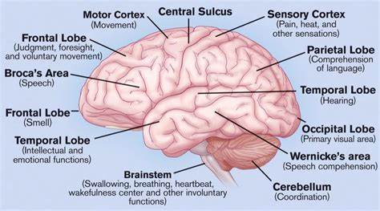

# D784-785 The science behind creativity
> **Kirsten Weir**
 > 

1, Paul Seli, PhD, is falling asleep. As he nods off, a sleep-tracking glove called Dormio, developed by scientists at the Massachusetts Institute of Technology, detects his **nascent** sleep state and **jar**s him awake. Pulled back from the **brink**, he jots down the artistic ideas that came to him during those semilucid moments.
Seli is an assistant professor of psychology and neuroscience at the Duke Institute for Brain Sciences and also an artist. He uses Dormio to **tap into** the world of **hypnagogia**, the transitional state that exists at the boundary between wakefulness and sleep. In a mini-experiment, he created a series of paintings inspired by ideas **plucked** from his hypnagogic state and another series from ideas that came to him during waking hours. Then he asked friends to rate how creative the paintings were, without telling them which were which. They judged the hypnagogic paintings as significantly more creative. “In dream states, we seem to be able to link things together that we normally wouldn’t connect,” Seli said. “It’s like there’s an artist in my brain that I get to know through hypnagogia.”

> **nascent** :新生的；萌芽的
>
> **brink**:边缘
>
> **jar**: （对…）产生不快的影响；使烦躁
>
> **hypnagogia**: 半梦半醒
>
> **tap into** :利用；挖掘；打入
>
> **pluck** :摘；拔；采摘
>

2, The experiment is one of many novel—and, yes, creative—ways that psychologists are studying the science of creativity. At an individual level, creativity can lead to personal fulfillment and positive academic and professional outcomes, and even be therapeutic. People take pleasure in creative thoughts, research suggests—even if they don’t think of themselves as especially creative. Beyond those individual benefits, creativity is an endeavor with implications for society, said Jonathan Schooler, PhD, a professor of psychological and brain sciences at the University of California, Santa Barbara. “Creativity is at the core of innovation. We rely on innovation for advancing humanity, as well as for pleasure and entertainment,” he said. “Creativity underlies so much of what humans value.”

3, In 1950, J. P. Guilford, PhD, then president of APA, laid out his vision for the psychological study of creativity (American Psychologist, Vol. 5, No. 9, 1950). For half a century, researchers added to the scientific understanding of creativity **incrementally**, said John Kounios, PhD, an experimental psychologist who studies creativity and insight at Drexel University in Philadelphia. Much of that research focused on the personality **trait**s linked to creativity and the cognitive aspects of the creative process.
But in the 21st century, the field has blossomed thanks to new advances in neuroimaging. “It’s become a tsunami of people studying creativity,” Kounios said. Psychologists and neuroscientists are uncovering new details about what it means to be creative and how to nurture that skill. “Creativity is of incredible real-world value,” Kounios said. “The ultimate goal is to figure out how to enhance it in a systematic way.”

> **incrementally**:递增地；增量模式；渐进性的
>
> **trait**:特点
>
> **Creativity in the brain**
>

4, What, exactly, is creativity? The standard definition used by researchers characterizes creative ideas as those that are original and effective, as described by psychologist Mark A. Runco, PhD, director of creativity research and programming at Southern Oregon University (Creativity Research Journal, Vol. 24, No. 1, 2012). But effectiveness, also called utility, is a **slippery concept**. Is a poem useful? What makes a sculpture effective? “Most researchers use some form of this definition, but most of us are also dissatisfied with it,” Kounios said.
Runco is working on an updated definition and has considered at least a dozen suggestions from colleagues for new components to consider. One frequently suggested feature is authenticity. “Creativity involves an honest expression,” he said.

> **slippery concept**:很难掌握的/模糊的概念
>

5, Meanwhile, scientists are also struggling with the best way to measure the concept. As a marker of creativity, researchers often measure divergent thinking—the ability to generate a lot of possible solutions to a problem or question. The standard test of divergent thinking came from Guilford himself. Known as the alternate-uses test, the task asks participants to come up with novel uses for a common object such as a brick. But measures of divergent thinking haven’t been found to correlate well with real-world creativity. Does coming up with new uses for a brick imply a person will be good at abstract art or composing music or devising new methods for studying the brain? “It strikes me as using way too **broad a brush,**” Seli said. “I don’t think we measure creativity in the standard way that people think about creativity. As researchers, we need to be very clear about what we mean.”

> **broad-brush**:  approach, strategy, or solution deals with a problem in a general way rather than concentrating on details
>

6, One way to do that may be to move away from defining creativity based on a person’s creative output and focus instead on what’s going on in the brain, said Adam Green, PhD, a cognitive neuroscientist at Georgetown University and founder of the Society for the Neuroscience of Creativity. “The standard definition, that creativity is novel and useful, is a description of a product,” he noted. “By looking inward, we can see the process in action and start to identify the characteristics of creative thought. Neuroimaging is helping to shift the focus from creative product to creative process.”

7, That process seems to involve the coupling of disparate brain regions. Specifically, creativity often involves coordination between the cognitive control network, which is involved in executive functions such as planning and problem-solving, and the default mode network, which is most active during mind-wandering or daydreaming (Beaty, R. E., et al., Cerebral Cortex, Vol. 31, No. 10, 2021). The cooperation of those networks may be a unique feature of creativity, Green said. “These two systems are usually **antagonistic**. They rarely work together, but creativity seems to be one instance where they do.”

> **antagonistic**：对立情绪的；对抗的
>

8, Green has also found evidence that an area called the **frontopolar cortex**, in the brain’s frontal **lobes**, is associated with creative thinking. And stimulating the area seems to boost creative abilities. He and his colleagues used **transcranial direct current stimulation (tDCS)** to stimulate the frontopolar cortex of participants as they tried to come up with novel **analogies**. Stimulating the area led participants to make analogies that were more semantically distant from one another—in other words, more creative (**Cerebral Cortex**, Vol. 27, No. 4, 2017).
Green’s work suggests that targeting specific areas in the brain, either with neuromodulation or cognitive interventions, could enhance creativity. Yet no one is suggesting that a single brain region, or even a single neural network, is responsible for creative thought. “Creativity is not one system but many different mechanisms that, under ideal circumstances, work together in a seamless way,” Kounios said.

> **lobe**: （身体器官的）叶
>
> **cranial**:颅的, 颅侧的
>
> **frontopolar cortex**：前额极皮层
>
> **Cerebral Cortex**：大脑皮层
>
> **transcranial direct current stimulation**： (tDCS)经颅直流电刺激
>

9, Which pathway a person uses might depend, in part, on their expertise. Kounios and his colleagues used electroencephalography (**EEG**) to examine what was happening in jazz musicians’ brains as they **improvise**d on the piano. Then skilled jazz instructors rated those improvisations for creativity, and the researchers compared each musician’s most creative compositions. They found that for highly experienced musicians, the mechanisms used to generate creative ideas were largely automatic and unconscious, and they came from the left posterior part of the brain. Less-experienced pianists drew on more analytical, deliberative brain processes in the right frontal region to devise creative melodies, as Kounios and colleagues described in a special issue of NeuroImage on the neuroscience of creativity (Vol. 213, 2020). “It seems there are at least two pathways to get from where you are to a creative idea,” he said.

> **EEG**：脑电图
>
> **improvise**：临时拼凑；即兴创作
>

10, Coming up with an idea is only one part of the creative process. A painter needs to translate their vision to **canva**s. An inventor has to **tinker** with their concept to make a prototype that actually works. Still, the aha moment is an undeniably important component of the creative process. And science is beginning to illuminate those “lightbulb moments.”
Kounios examined the relationship between creative insight and the brain’s reward system by asking participants to solve **anagrams** in the lab. In people who were highly sensitive to rewards, a creative insight led to a burst of brain activity in the **orbitofrontal cortex**, the area of the brain that responds to basic pleasures like delicious food or addictive drugs (NeuroImage, Vol. 214, 2020). That neural reward may explain, from an evolutionary standpoint, why humans seem driven to create, he said. “We seem wired to take pleasure in creative thoughts. There are neural rewards for thinking in a creative fashion, and that may be adaptive for our species.”

> **canvas**：帆布；画布；油画
>
> **tinker**：小修补
>
> **anagrams**:回文，相同字母异序词
>
> **orbitofrontal cortex**：前额脑区底部
>
> Day 784 截止处 （暂定）
>

---

1 The rush you get from an aha moment might also signal that you’re onto something good, Schooler said. He and his colleagues studied these flashes of insight among creative writers and physicists. They surveyed the participants daily for two weeks, asking them to note their creative ideas and when they occurred. Participants reported that about a fifth of the most important ideas of the day happened when they were mind-wandering and not working on a task at hand (Psychological Science, Vol. 30, No. 3, 2019). “These solutions were more likely to be associated with an aha moment and often overcoming an **impasse** of some sort,” Schooler said.

> **impasse**：僵局
>

2 Six months later, the participants revisited those ideas and rated them for creative importance. This time, they rated their previous ideas as creative, but less important than they’d initially thought. That suggests that the spark of a **eureka** moment may not be a reliable clue that an **idea has legs**. “It seems like the aha experience may be a **visceral** marker of an important idea. But the aha experience can also inflate the meaningfulness of an idea that doesn’t have merit,” Schooler said. “We have to be careful of false ahas.”
**has legs** ：To have the ability to endure, stay relevant, or continue to maintain interest.

> **eureka**: a cry of joy or satisfaction when one finds or discovers something.
>
> **visceral**：resulting from strong feelings rather than careful thought（未经过认真思考而）
>
> **In search of the eureka moment**
>

3 Creativity looks different from person to person. And even within one brain, there are different routes to a creative spark, Kounios explained. One involves what cognitive scientists call “System 1” (also called “Type 1”) processes: quick, unconscious thoughts—aha moments—that burst into consciousness. A second route involves “System 2” processes: thinking that is slow, deliberate, and conscious. “Creativity can use one or the other or a combination of the two,” he said. “You might use Type 1 thinking to generate ideas and Type 2 to critique and refine them.”

> **Boosting your creativity**
>

4 Much of the research in this realm has focused on creativity as a trait. Indeed, some people are naturally more creative than others. Creative individuals are more likely than others to possess the personality trait of openness. “Across different age groups, the best predictor of creativity is openness to new experiences,” said Anna Abraham, PhD, the E. Paul Torrance Professor and director of the Torrance Center for Creativity and Talent Development at the University of Georgia. “Creative people have the kind of curiosity that draws them toward learning new things and experiencing the world in new ways,” she said.

5 We can’t all be Thomas Edison or **Maya Angelou**. But creativity is also a state, and anyone can push themselves to be more creative. “Creativity is human capacity, and there’s always room for growth,” Runco said. A tolerant environment is often a necessary ingredient, he added. “Tolerant societies allow individuals to express themselves and explore new things. And as a parent or a teacher, you can model that creativity is valued and be open-minded when your child gives an answer you didn’t expect.”

> **Maya Angelou**: 马娅·安杰卢，美国作家和诗人
>

6 One way to let your own creativity flow may be by **tapping into** your **untethered** mind. Seli is attempting to do so through his studies on **hypnagogia**. After pilot testing the idea on himself, he’s now working on a study that uses the sleep-tracking glove to explore creativity in a group of Duke undergrads. “In dream states, there seems to be connectivity between **disparate** ideas. You tend to link things together you normally wouldn’t, and this should lead to novel outcomes,” he said. “Neurally speaking, the idea is to increase connectivity between different areas of the brain.”
You don’t have to be asleep to forge those creative connections. Mind-wandering can also let the ideas flow. “Letting yourself daydream with a purpose, on a regular basis, might allow brain networks that don’t usually cooperate to literally form stronger connections,” Green said.

> **tap into**：开发 ; 探寻
>
> **untethered** ：不受限的、 (似)不被绳索捆束的
>
> **hypnagogia**： 临睡幻觉
>
> **disparate**：迥然不同的 [正式]
>

7 However, not all types of daydreams will get you there. Schooler found that people who engage in more personally meaningful daydreams (such as fantasizing about a future vacation or career change) report greater artistic achievement and more daily inspiration. People who are prone to fantastical daydreaming (such as inventing alternate realities or imaginary worlds) produced higher-quality creative writing in the lab and reported more daily creative behavior. But daydreams devoted to planning or problem-solving were not associated with creative behaviors (Psychology of Aesthetics, Creativity, and the Arts, Vol. 15, No. 4, 2021).

8 It’s not just what you think about when you daydream, but where you are when you do it. Some research suggests spending time in nature can enhance creativity. That may be because of the natural world’s ability to restore attention, or perhaps it’s due to the tendency to let your mind wander when you’re in the great outdoors (Williams, K. J. H., et al., Journal of Environmental Psychology, Vol. 59, 2018). “A lot of creative figures go on walks in big, expansive environments. In a large space, your **perceptual** attention expands and your scope of thought also expands,” Kounios said. “That’s why working in a **cubicle** is bad for creativity. But working near a window can help.”

> **perceptual**：知觉的；感知的
>
> **cubicle**：小卧室；箱；小隔间
>

9 Wherever you choose to do it, fostering creativity requires time and effort. “People want the booster shot for creativity. But creativity isn’t something that comes magically. It’s a skill, and as with any new skill, the more you practice, the better you get,” Abraham said. In a not-yet-published study, she found three factors predicted peak originality in teenagers: openness to experience, intelligence, and, importantly, time spent engaged in creative hobbies. That is, taking the time to work on creative pursuits makes a difference. And the same is true for adults, she said. “Carve out time for yourself, figure out the conditions that are conducive to your creativity, and recognize that you need to keep pushing yourself. You won’t get to where you want to go if you don’t try.”
Those efforts can benefit your own sense of creative fulfillment and perhaps lead to rewards on an even grander scale. “I think everyday creativity is the most important kind,” Runco said. “If we can support the creativity of each and every individual, we’ll change the world.”

