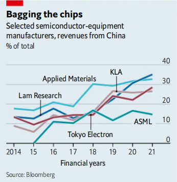

# D805 Crossing the chokepoint
> **chokepoint**: 咽喉点,又译作阻塞点或是瓶颈。是为军事战略上的一种地理特征，诸如山谷狭径或是隘口等。
 > 
> **household name**: 家喻户晓的名字
 > 
> **gut **: 损毁（建筑物或房屋的）内部
 > 
> **crunch**：嚼；关键时刻；危机
 > 
> **ruction**：吵闹
 > 
> **Tokyo Electron**:东京电子
 > 
> **tsmc**: 台积电
 > 
> **asml**:中文名称为阿斯麦尔（中国大陆）、艾司摩尔（中国台湾）。这是一家总部设在荷兰埃因霍芬（Eindhoven）的全球最大的半导体设备制造商之一，向全球复杂集成电路生产企业提供领先的综合性关键设备。
 > 
> **kla**: 科磊半导体，全球第五大半导体生产商，拥有晶圆检测与光罩检测系统。
 > 
> **Lam Research:** 科林研发公司（或：拉姆研究、泛林集团）Lam Research Corporation (NASDAQ:LRCX)创立于1980年，总部位于美国加州弗里蒙特，全职雇员11,000人，是向世界半导体产业提供晶圆制造设备和服务的主要供应商之一，是目前全球第三大半导体生产商（仅次于ASML和AMAT）。
 > 

2.Such tools handle the complex processes of **scratching** billions of electric circuits into a silicon wafer. Those circuits shuttle electrons to do the calculations that display this article on a screen, plot your route across town or allow your fingerprint to unlock your phone. They must be perfect. kla makes measurement tools which are essentially electron microscopes on **steroid**s, scanning each part of a finished chip automatically for defects and errors. Some Lam Research tools are designed to **etch** patterns in a **silicon wafer** by firing beams of individual atoms at its surface. Applied Materials builds machines which can deposit films of material that are merely a few atoms thick.

> **scratch**: damage surface损坏表面
>
> **steroid**:类固醇；甾族化合物
>
> **etch**：蚀刻; 凿刻
>
> **wafer**:圆片，晶片；薄片，干胶片；薄饼；圣饼
>
> **silicon wafer**: 硅片；硅圆片
>
> **atom beam**:原子束
>

3.The Chinese government’s efforts to develop a large and advanced semiconductor industry at home using these **mind­boggling** technologies have led to a rapid shift in the source of the revenues for the firms making it over the past five years. In 2014 the five main toolmakers sold gear worth $3.3bn, 10% of the global market, to China. Today the country is their largest market by a significant margin, making up a quarter of global revenues (see chart). Of the $23bn in sales for Applied Materials, the largest equipment­maker, during its latest fiscal year, $7.5bn came from China. It accounts for over a third of **Lam Research**’s revenues of $14.6bn, the largest share of any big tool maker (though the firm notes that some portion of Chinese sales are made to multinational firms that operate there).

> **mind­boggling**: 难以置信的；难以想象的
>
> **Lam Research**: 科林研发
>

4.This new reliance has created political and commercial problems, particularly for the trio of American toolmakers: Applied Materials, kla and Lam Research. The Chinese government has thrown hundreds of billions of dollars at domestic chipmakers. Because each of the American trio is dominant at a different step of the process, the unavoidable conclusion is that America’s most advanced technology is furthering China’s economic goals. There is strong bipartisan agreement in Washington that this is unacceptable.

> **kla**:科磊半导体KLA-Tencor Corporation
>

5.America’s government has long sought solutions to this uncomfortable problem. In December 2020 it placed **smic**, China’s leading chipmaker, on an export blacklist. Any American company wishing to sell products to smic had to apply for a licence. But tools have kept flowing to the Chinese firm, in part because America acted alone. The Chinese government’s lavish subsidies have instead started finding their way to non-American competitors. **Applied Materials** noted that this might help other firms as, in effect, shutting it out of China “could result in our losing technology leadership relative to our international competitors”.

> **smic**: 中芯国际公司
>
> **Applied Material**: 应用材料公司Applied Materials, Inc.:全球最大半导体设备商
>

6.The problem is becoming more acute. semi, the global semiconductor-tooling trade body, announced on April 12th that worldwide industry revenues from China grew by 58% in 2021, to $29.6bn, cementing its place as the world’s largest market. Political pressure is rising. In March two Republican lawmakers wrote to America’s Department of Commerce demanding a tightening of export controls on chip technology going to China, specifically mentioning chipmaking equipment.

> **SEMI** (国际半导体产业协会)是全球性的产业协会，致力于促进微电子、平面显示器及太阳能光电等产业供应链的整体发展。
>

7.China’s appetite for chipmaking tools is also causing commercial difficulties for non-Chinese chipmakers, **depriving them of** equipment and hence the capacity to manufacture chips. On April 14th C.C. Wei, the boss of tsmc, said the Taiwanese firm had encountered an unexpected “tool delivery problem” that threatened its ability to make enough chips. Though he did not blame China, chip-industry insiders say it is the likely cause. tsmc has warned Apple and Qualcomm, two of its largest customers, that it may not be able to meet their demand in 2023 and 2024, according to two independent sources.

> **deprive sb of** ：剥夺某人的
>
> **tsmc**：台积电
>

8.Over the past four months the American toolmakers have started working with the government, through Akin Gump, a firm of lawyers and lobbyists based in Washington, dc, to find a way round the problem. The toolmakers formed the Coalition of Semiconductor Equipment Manufacturers late last year to further that aim, using Akin Gump to represent them. Lawyers have been **poring over** the products of Applied Materials, Lam Research and kla in an attempt to identify workable export controls under which less advanced pieces of equipment that are not used for cutting-edge manufacturing might still be sold to China, while more advanced tools would be prohibited. That would allow the toolmakers to **retain** some portion of their Chinese revenues.

> **AKIN GUMP**: 美国艾金岗波律师事务所
>
> **pore over**:钻研
>

9.Efforts to figure out where to draw the line continue. Akin Gump has been lobbying cabinet members and legislative leaders on behalf of the coalition, and is in ongoing discussions with both the Biden administration and members of Congress. “The plan is being driven by the Biden administration,” the Coalition said in a statement on April 25th.

10.The proposal **hinges on** getting America’s allies—in particular Japan and the Netherlands, home to Tokyo Electron and asml—to impose the same export controls on their toolmakers. The chances of this have increased since Russia’s assault on Ukraine. Officials around the world have been regularly **putting their heads** together to understand the effect America’s bans on trade with Russia will have on their countries. That has created channels through which the complex task of shutting China out of advanced chipmaking, a far trickier task than curbing sales of oil or weapons, might take place.

> **Hinge on**：取决于
>
> **Put heads together**: 一起商讨问题；聚在一起商量、集思广益
>

11.The plan may yet fall apart. China is unlikely to accept it **meekly**. Hawks in Washington may push for harder restrictions. Defining what equipment can continue to be exported to China may prove too difficult. But if it works, Chinese chipmakers would need decades to catch up with the West—and America would have met its goals of suppressing Chinese semiconductor development while causing minimal harm to its own industry.

> **meekly**：温顺地
>

