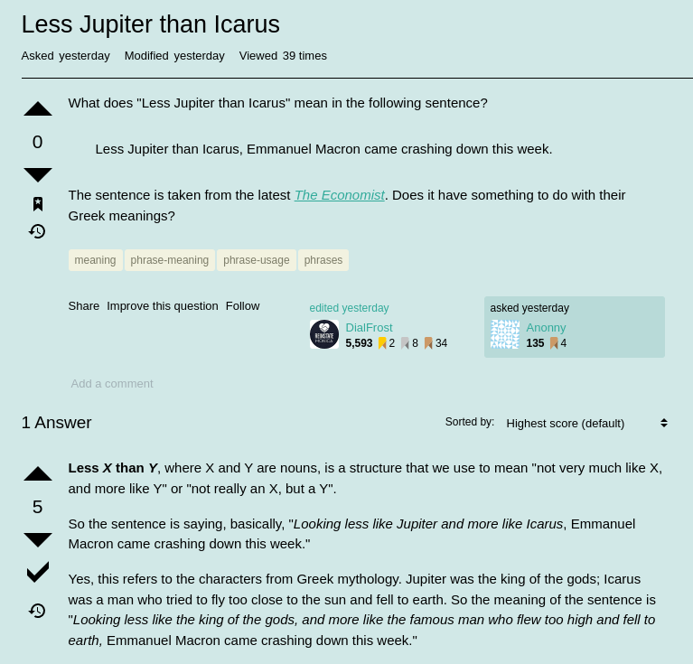
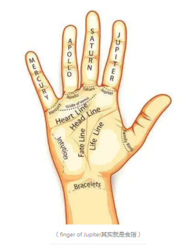

# D861  The man who fell to earth 
> 联动 D779 Why Macron matters
 > 

1. Less jupiter than Icarus, Emmanuel Macron came crashing down this week. On June 19th French voters did something that was last seen over 30 years ago: they denied a newly elected president a majority in the National Assembly. It is not quite impossible to govern without one, but for the next five years Mr Macron will be scratching around for the votes he needs to get anything done. That is bad news for France—and for Europe too, which **sorely** lacks a leader of global **stature**. Angela Merkel left the field last winter, and the man who had hoped to reshape a continent after her departure will have his work cut out just keeping his own house in something that resembles order.

> 伊卡洛斯; 代达罗斯之子，以其父制作的蜡翼飞离克里特岛，其父逃脱了，不听他父亲的警告，他因飞得太高阳光融化了他的蜡翼，坠海而亡
>
> **Sorely**: 非常
>
> **Stature**:身高, 个子, 声望, 名望
>
> If you say that you will **have your work cut out** to do something, you mean that it will be a very difficult task.
>

2. This outcome should not have been as surprising as it felt. In the first round of the presidential election in April, slightly more than half the electorate cast votes for one or other candidate of the political extremes. Enough of them then **rallied** round Mr Macron in the **run­off** to allow him to **handily** defeat Marine Le Pen, the leader of the populist National Rally. But the impressive result masked the fact that Mr Macron, a **buttoned ­up** technocrat who has never been able to shake off the label of le président des riches, is loved by only a few, and loathed by many. He won just 28% of the vote in the first round, after all. The French gave him his job back, but they also decided to strip him of much of his authority. Clearly, Mr Macron will need to do things differently.

> **rally**: 召集；集合；复原vt，恢复；重新振作vi
>
> **cast vote**:to vote
>
> **run­off **: 决选投票，进行决赛
>
> **handily**: 容易地；轻松地
>
> **buttoned ­up**: 守口如瓶；沉默寡言
>

3. But what, exactly, and how? To understand the scale of the task ahead, consider how Mr Macron is in some ways the victim of his own success. In his first term his political machine was all­ conquering, **poaching** the best and brightest from the centre-right Republicans and the centre­-left Socialists. By **straddling** the mainstream, he pushed dissatisfied voters to Ms Le Pen’s hard right or the radical left of Jean­Luc Mélenchon. For Mr Macron to **pacify** the angry, left­ behind voters who gave both these candidates a huge electoral boost will not be easy, especially  without spending even more money that France does not have.

> **poach**: 盗用；窃取；挖走;用不正当手段取得(有利的起步)
>
> **straddle**: 叉开腿走；不表明态度;(对政治问题等)采取骑墙观望态度
>
> **pacify**: 平息；抚慰；使平静；平息战争
>
> **centre-right :中间偏右**是用来描述政治观点在 政治光谱 上横跨中间派与 右派 ，但不包含**极右派**
>
> 立场的个人、政党或组织（如智库 ）。
>
> 跨式套利(Straddle)，也叫马鞍式期权、骑墙组合、等量同价对敲期权、双向期权(Double Options)、底部跨式期权(Bottom Straddle)，是指以相同的执行价格同时买进或卖出不同种类的期权。
>

4. Ideally Mr Macron would continue to pursue the difficult long­term reforms that France badly needs—simplifying its **labyrinthine** pensions system, laying the foundations for its energy transition and prising open its rigid, highly centralised education system. Yet the future looks hard. Mr Macron’s legislative agenda is **up in the air**. He has summoned the party leaders to talks. The constitution gives him considerable powers, particularly in the areas of foreign and defence policy, and he also has the right, if need be, to force his budget and one other piece of legislation through parliament by **decree** in each sitting. But if he is seen to abuse that authority, he may provoke a no­-confi­dence vote that could bring down his government and perhaps force yet another parliamentary election.

> **labyrinthine**: 迷宫似的
>
> **up in the air**: 悬而未决的
>
> **prise**: 强行使分开；撬开
>
> **decree**: 判决；颁布；裁定
>

5. One option is to try to assemble ad hoc majorities for individual bills. His parliamentary grouping, Ensemble, has 245 seats; 44 **short of** a majority. He may, for instance, hope to appeal to the Republicans to get his pension reform through; or to the Socialists and the Greens to help him out with the energy transition. Yet both measures will face resistance and if early elections are thought likely, no one will want to risk losing their own voters to the Macron­-loathing extremes.

> **ad hoc**: 临时安排的；特别的；专门的；即插即用
>
> **short of:** 缺少；达不到
>

6. France, with its almost monarchical presidency, lacks a tradition of coalition government. In Germany, the Netherlands or the **Nordic countries** such arrangements involve weeks or months of negotiation, to **hammer out** detailed policy agreements. French politics, as so often in the past, is deeply polarised, perhaps too much so for even the most limited agreement on policies. Mr Macron will therefore need to alter that culture. This will require him to embrace a new political style: no longer **Jupiterian**, controlled and **analytical,** but open, transactional and instinctive. It will not come naturally, but if he fails, his second term will be doomed to fail too.

> **Nordic countries**: 北欧国家
>
> **hammer out **: 苦心想出；推敲出;设计出
>
> **analytical**: 善于分析的
>
> **Jupiterian**: 雄心勃勃的
>
> 西方看手相的人把**Mount of Jupiter**和**finger of Jupiter**长的好的人称为Jupiterian，这种手相的人也通常被认为有雄心，有领导能力。所以Jupiterian其实指的是有远大志向有领导力的
>
> **term**:
>
> **n. （某人做某事或某事发生的）时期，期限，任期；学期，开庭期；到期，期满；术语**
>
> **v. 把……称为，把……叫做**
>
> The term 'post-industrial' now has wide currency：“后工业时代”一词现在广泛使用
>
> I'll be teaching history and sociology next term：下学期我要教历史和社会学
>

