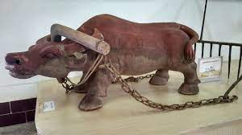
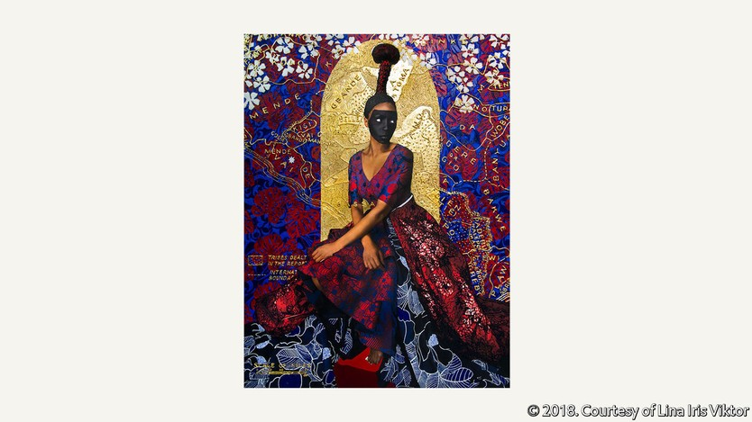
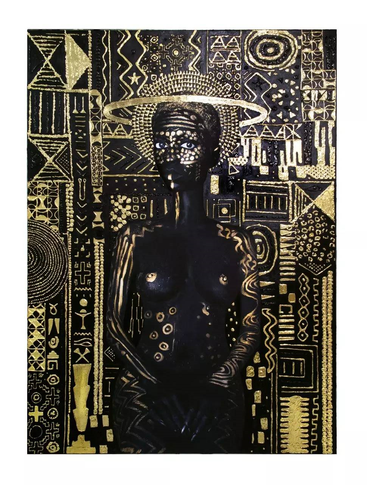
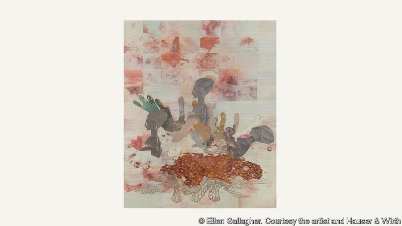

# D869 A brilliant exhibition uses the fantastic to explore race
1 Chains of black arms, made of **resin**, descend from the ceiling of the Hayward Gallery in London. They grip one another, evoking interconnectedness, **agency**—and also the **yoke** of slavery. “Chain Reaction”, a striking yet disturbing installation by Nick Cave, is the first artwork that viewers encounter on entering “In the Black Fantastic”, a groundbreaking new exhibition curated by Ekow Eshun. It features 11 artists from across the **African diaspora** who use fantasy to probe race and identity.

> **Resin** is a sticky substance that is produced by some trees. 树脂
>
> **agency:** action or intervention, especially such as to produce a particular effect.
>
> If you say that people are under the **yoke** **of** a bad thing or person, you mean they are forced to live in a difficult or unhappy state because of that thing or person. 羁绊; 枷锁
>
> plow：犁; 似犁的工具; 北斗七星;
>
> People who come from a particular nation, or whose ancestors came from it, but who now live in many different parts of the world are sometimes referred to as **the** **diaspora**. 大移居
>

2 By leapfrogging the confines of the past and present, imaginary worlds offer a radical sense of freedom. Yet even as the artworks contemplate the future, the artists confront racial legacies and modern sensibilities around blackness. Just as Mr Cave’s interlinked limbs could be reaching back to the past or pointing towards the future, the show’s subject matter spans black **ancestral** stories and **unlived** destinies. In these artworks, the past, present and future are inextricably linked.

3 By transporting the viewer from one fantastical world to the next, the exhibition leans on **Afrofuturism**, a movement that uses myth, speculative fiction and fantasy to explore the black experience. The concept went unnamed until 1994, when Mark Dery, a cultural critic, wrote an essay called “Black to the future”. “Can a community whose past has been deliberately rubbed out, and whose energies have subsequently been consumed by the search for **legible** traces of history, imagine possible futures?” he asked.

> **Afrofuturism**: 非洲未来主义，主张以黑人为主体来探讨人类社会与文化的未来。同时它也是对于未被殖民侵略之前的非洲文明的一种复兴运动。
>
> **legible**: 清晰可读的；清楚的
>
> **afro**:非洲式的
>

4 A loud “yes” **resound**s in the works of Samuel Delaney, one of the first African-American science-fiction writers whose **debut** novel was published in 1962; in the cosmic tilt of Sun Ra Arkestra’s experimental, genre-busting music; and even in the writing of Kodwo Eshun, the curator’s brother, whose **seminal** work of 1998, “More Brilliant than the Sun: Adventures in Sonic Fiction”, analyses the links between Afrofuturist sounds in music and science fiction in the African **diaspora**. Black creators have been imagining new realities for over half a century.

> **resound**: 回响；回荡
>
> **bust**: 打破；摔碎；突击搜查
>
> seminal:开创性的
>
> seminar:研讨会
>
> diaspora:侨民
>

5 Today mainstream audiences are increasingly familiar with Afrofuturist ideas thanks to the **eclectic** music of pop artists such as Janelle Monáe and “**Black Panther**”, a film based on a Marvel comic which reimagines black progress through technology. Curators are embracing the theme too; a feast of Afrofuturist cinema, music and visual art has appeared at institutions on both sides of the Atlantic in the past year.

> **Black Panther:黑豹**
>

6 The movement’s recent popularity means that it is being interpreted in different ways. To some extent, this is inevitable. After all, Afrofuturism is hyper-subjective and leaps around in time, something that Mr Eshun acknowledges by giving each artist a room of their own and space for their ideas to breathe. The glorious, spiritual self-portraits of Lina Iris Viktor, a Liberian-British artist, embody the **divine** (pictured, above). Her **adjacent** sculptures take inspiration from ancient West African sculpting traditions but “represent figures who communicate knowledge across time”.

> **adjacent**: 紧接着的；邻近的
>

7 By contrast, Ellen Gallagher’s ethereal paintings respond to more recent, tragic history (pictured, below). Her work, characterised by bloody pink **hues**, draws on the myth of an underwater empire beneath the Atlantic, **populate**d by the children of pregnant enslaved African women brutally thrown overboard during deportation to America. At least 1.8m Africans perished during the **Middle Passage**; in Ms Gallagher’s paintings they are reborn as members of a **subaqueous** civilisation. (It was Drexciya, an electronic music duo from Detroit, who first proposed this alternative history in 1992. It has inspired multiple reinterpretations since.)

> **hue**: 色调；颜色；
>
> **populate**: 迁移；移居；to move people or animals to an area to live there
>
> In chemistry, an **aqueous** solution or cream has water as its base. (化学)含水的; 水溶液的
>
> **subaqueous**: 水下的；水下用的
>
> aqueo- [L. aqua, water] **Prefixes meaning water**.
>
> **Middle Passage **: 中央航路/中间通道the journey from western Africa across the Atlantic to the Caribbean or the Americas, formerly undertaken by many slave ships.
>

8 The exhibition is full of **collage**, nuance and unexpected **juxtaposition.** Mr Eshun drew on the writings of the sociologist W.E.B Du Bois, who in 1903 described the burden of “**double consciousness**”. Du Bois believed that African-American people were limited by only seeing themselves through the eyes of others. Mr Eshun sees this instead as a gift. “Being obliged to look through two perspectives at once has its own power. It allows us to see contradiction. It allows us to see complexity. It allows us to see many colours at once,” he says.

> A **collage** is a picture that has been made by sticking pieces of coloured paper and cloth onto paper. 拼贴画
>
> **nuance**: 细微差别
>
> **juxtaposition.**:并列
>
> **Double-consciousness** is a concept in social philosophy referring, originally, to a source of inward “twoness” putatively experienced by African-Americans because of their racialized oppression and disvaluation in a white-dominated society.
>

9 The show embraces Afrofuturism in spirit. Yet Mr Eshun **shies away** from the label, as do others who have been associated with it. Some worry that the term has become a buzzword for any science fiction that significantly involves black people. Others are rightly concerned that the movement has **rendered** non-American black perspectives on the future secondary. In **defiance**, Nnedi Okorafor, a Nigerian-American sci-fi writer, coined the term “Africanfuturism”.

> **shy away**: 避开；回避
>
> **render**:表现；反映;致使
>
> **defiance**: 无视；蔑视
>
> **in defiance of**: 无视
>

10 Despite these tensions, Afrofuturism is vast by design because the vastness is liberating. And as museums and art galleries come under increasing pressure to move beyond reductive, traumatic depictions of blackness, the **breadth** of Afrofuturist art offers infinite possibilities. “We know that we can break history down because the history we’ve been given has been biased,” says Louis Chude-Sokei, who helped curate an Afrofuturist music festival at Carnegie Hall in February and March. “But what does it mean to take on the future? That’s a big deal.”

> **breadth**: 宽度
>

