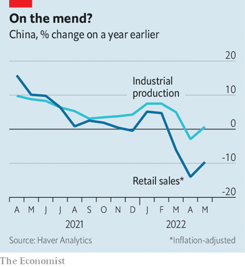

# D875 In stamping out covid, China has stomped on confidence
> **Stomp on** :  to step on (something or someone) very forcefully.跺脚，践踏，重踏
 > 

1 Foreign economists are forever urging China to increase its consumer spending. On June 18th each year, the country tends to **oblige**. That is the date of the “618” shopping festival, promoted by jd.com, which was founded on the same day in 1998. The company started life in a modest, four-square-metre shop in Beijing, selling vcds and dvds. But during the sars epidemic of 2003-04, when the capital’s shopping districts fell quiet, it moved online. It was hugely successful, becoming one of China’s biggest e-commerce firms—a triumph of commerce over a coronavirus.

> To **oblige** someone means to be helpful to them by doing what they have asked you to do. (通过满足要求而) 帮助
>

2 China’s retailers will hope this year’s 618 marks a similar victory. After months of lockdowns and restrictions to contain another coronavirus outbreak, China’s shoppers now have a bit more freedom to move about and an occasion to **splash out.**
China’s vast machinery of production and distribution also appears more ready to serve them. By June 10th, almost 55% of the listed companies operating in Shanghai had announced a resumption of work, notes **CICC**, a bank. And over half of the couriers surveyed by Kuaidi100, a data provider, said that they have been busier in **the build-up to** this year’s 618 than last year’s.

> **Splash out:** to spend (money) freely or extravagantly (on something) 大肆挥霍(金钱)
>
> **Kuaidi100**:快递100 查快递的公司
>
> **CICC**：中国国际金融有限公司（China International Capital Corporation）
>
> A **courier** is a person who is paid to take letters and packages direct from one place to another. 信使
>
> The **build-up** to an event is the way that journalists, advertisers, or other people talk about it a lot in the period of time immediately before it, and try to make it seem important and exciting. 大肆宣传
>

3 In Shanghai and the nearby provinces of Jiangsu and Zhejiang, power plants are now consuming about as much coal as last year, points out cicc, a sign that their local economies are plugging themselves back in. Indeed, despite all the logistical impediments they faced, China’s manufacturers, miners and utilities were able to churn out more stuff last month than they did in 2021, according to figures released on June 15th. Industrial production rose by 0.7% in May compared with a year earlier, defying fears of another decline.

4 China’s exports also **fared** better than expected, growing by almost 17% in dollar terms in May, compared with a year earlier. Much of the shipping traffic that could not pass through Shanghai migrated to the port of Ningbo in Zhejiang instead. China’s proliferation of ports, which once looked like overcapacity, now looks like helpful redundancy. When a country has to shut down a vital global trade hub, it is handy to have a second one 150km to the south. **dire**

> **fare**: perform in a specified way in a particular situation or over a particular period of time.
>
> **fare**【外刊常查】: 【cet6】n. 费用, 旅客, 食物; vi. 进展, 进步, 经营, 过活
>
> **dire**【外刊常查】: 【前15%】a. 可怕的, 悲惨的, 阴沉的, 极端的
>

5 The constraints on China’s ability to make things and distribute them are, then, lifting. But what remains **fettered** and caged is the consumer’s willingness to buy them. Consumer confidence is at a record low. Retail sales fell by almost 10% **in real terms** in May, compared with a year earlier, having declined by 14% the month before (see chart). Catering shrank by more than a fifth. In places like Shanghai and Beijing, people still face mandatory covid testing and “mini-lockdowns” in neighbourhoods where cases appear. That makes **mingling** in markets and malls a risky endeavour.

> You can use **fetters** to refer to things such as rules, traditions, or responsibilities that you dislike because they prevent you from behaving in the way you want. 禁锢
>
> At a party, if you **mingle** **with** the other people there, you move around and talk to them. 交际
>

6 Demand for housing is also strikingly subdued. Sales of new flats (measured by floor space) fell by over 30% in the year to May. The government has cut mortgage rates a little. It has also allowed local authorities to ease some regulatory curbs on property purchases. But the main restriction now seems to be poor **morale**. China’s forever war against covid seems to have **vanquish**ed another formidable foe: property **speculation**.

> **Morale** is the amount of confidence and cheerfulness that a group of people have. 士气
>
> **speculation**:投机，投机买卖
>

7 The one exception to this **gloomy** consumer data is online sales, which grew by 7% last month, compared with a year ago. During this year’s 618 festival, many retailers are hoping to **usher** their customers into virtual-shopping spaces in the metaverse. They are dangling before them digital collectibles and non-fungible tokens, based on characters from “Journey to the West”, a classic of Chinese literature, and “Transformers”, a **movie franchise**. Under China’s draconian zero-covid policies, “real life” can lose much of its vivacity and **spontaneity**. The metaverse might seem unusually appealing. At least you don’t have to take a covid test to get in.

> If a place is **gloomy**, it is almost dark so that you cannot see very well. 昏暗的
>
> If you **usher** someone somewhere, you show them where they should go by going with them. 引领
>
> **Movie franchise**: 电影系列
>
> **Spontaneity** is spontaneous, natural behaviour. 自发行为; 自然举动
>

