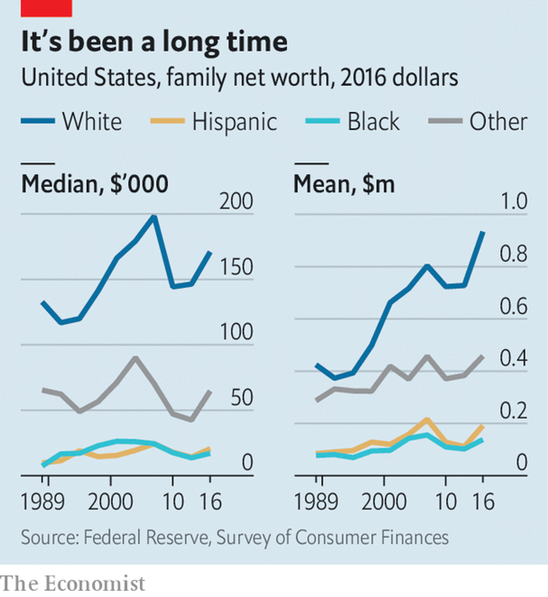

# DAY 112  The black-white wealth gap is unchanged after half a century
1 Few americans remember Greenwood, a once-prosperous African-American neighbourhood in Tulsa, Oklahoma, that was known as Black Wall Street. In 1921 Dick Rowland, a black shoeshiner, was charged with attempting to rape a white lift-girl in a downtown office building. An incensed white mob gathered at the courthouse to lynch him, then proceeded to Greenwood for two days of rioting, looting and murder. City officials aided and abetted the violence. In the end 35 blocks were destroyed, 10,000 black people were made homeless, and as many as 300 were killed. Residents reported aeroplanes flying overhead, dropping explosives. It was one of the worst incidents of racial violence since the civil war. Tens of millions of dollars in black wealth were destroyed or stolen. No compensation was awarded to either the victims or their descendants.

2 American history is replete with horrific episodes that prevented the accumulation of black wealth for centuries: first slavery, then indentured servitude under Jim Crow, segregated housing and schooling, seizure of property and racial discrimination. The result was that in 1962, two years before the passage of landmark civil-rights legislation and the Great Society programme, the average wealth of white households was seven times greater than that of black households. Yet after decades of declining discrimination and the construction of a modern welfare state, that ratio remains the same. The mean of black household wealth is $138,200—for whites, that number is $933,700.

3 Median wealth is smaller, but even more lopsided. The typical black family has just $17,100 compared with the typical white one, which has $171,000. The discrepancies are caused by low incomes and by debt. Compared with whites, black Americans have higher debt loads: 19.4% of black households have net wealth at or below $0, compared with 9.2% of whites. There had been slow improvement over the decades, but the Great Recession of 2007-08 wiped this out, since blacks were disproportionately harmed by the subprime mortgage blow-up. Because of that, home-ownership, the conventional wealth-building tool of the middle class, stands at 42% among blacks—only one percentage point higher than it was in 1968—compared with 73% for whites.

4 Determining what lies behind the persistent wealth gap is essential to fixing it. The thinking ascendant on the left blames both present-day discrimination and the long history of racist public policies, such as redlining, an official practice that made it harder for blacks to get mortgages, and so permanently disrupted the transmission of wealth between generations. One cure for this state of affairs is reparations, a one-off cash transfer to compensate for the lasting effects of slavery and discrimination. The idea, long popular on the political fringe, has emerged as a faultline among the Democratic presidential primary contenders. Julián Castro, Barack Obama’s former housing secretary, criticised Senator Bernie Sanders for dismissing the idea. Elizabeth Warren, a Massachusetts senator, says she is on board, and suggested that Native Americans should be “part of the conversation” too.

5 But more ordinary forces could also be at play. Wealth is, at its core, the accumulation of savings over time. Lower salaries (and lower saving rates) thus limit the opportunity for wealth growth. A recent study by Dionissi Aliprantis and Daniel Carroll, research economists at the Federal Reserve Bank of Cleveland, argues that the persistent racial gap in wealth can be almost entirely accounted for by the racial gap in income. According to the latest figures, from 2017, the median black household takes in $40,258 a year compared with $68,145 for the typical white one. Calculations by Edward Wolff, an economist at New York University, suggest that inheritances can explain about 23% of the racial wealth gap. His research suggests that the gap would close only modestly if blacks inherited wealth to the same extent as whites do.

6 If the cause of the persistent wealth gap is really a long-term income disparity, the policies needed to rectify it are different. Even as discrimination has declined and the country has instituted affirmative action programmes in university admissions and some job hiring, the black-white income gap remains high. A portion of this is due to present-day discrimination. There is strong evidence that employers are less likely to call back applicants with black-sounding names, for example. But there have also been other structural changes to black America that have led to this stagnant outcome: deindustrialisation, which hit blacks living in cities especially hard, rising incarceration rates and the decline of stable two-parent families. These are all tied up in a complex tangle of pathology, all of which is to some degree the legacy of historical racism. But a lump-sum reparations payment, even if sizeable, would not lead to wealth convergence if present-day racial income patterns remained fixed.

7 And the politics of reparations remains treacherous. Even race-neutral anti-poverty programmes, like cash welfare and food stamps, already attract fierce opposition, in no small part because they are often seen by white voters as handouts to minorities and immigrants. Reparations would surely worsen the racial divide—perhaps to Donald Trump’s electoral benefit.

8 A more promising proposal for narrowing the inheritance gap, offered by Darrick Hamilton and William Darity, two economists, is “baby bonds”—essentially trust accounts for every child born in America, which could not be accessed until adulthood. The federal government would top up these accounts each year, depositing more for poorer families. Cory Booker, a New Jersey senator running for president, has proposed legislation to do this.

9 The annual cost would be $82bn, according to one analysis from Columbia University (for context, the budget for the federal Department of Housing and Urban Development is $53bn). Universal access to the trust accounts might stave off opposition. “In a lot of ways, it is replicating what happened in the New Deal with the gi bill and the federal housing loans that excluded blacks,” says Mr Hamilton. He also likens the idea to the birth of the Social Security (pensions) programme. “We as a society decided that we didn’t want our elderly to be economically insecure. So the government came up with a programme. We don’t have anything for young people except subsistence programmes to keep them from being destitute,” he says.

10 One vulnerability is that the policy has a built-in lag time of 18 years and benefits a constituency that cannot vote or hire lobbyists. Britain introduced a similar scheme, only to cancel it six years later. And although a government-funded inheritance would go some way to making up for historical injustices, it would not erase the black-white income gap.

