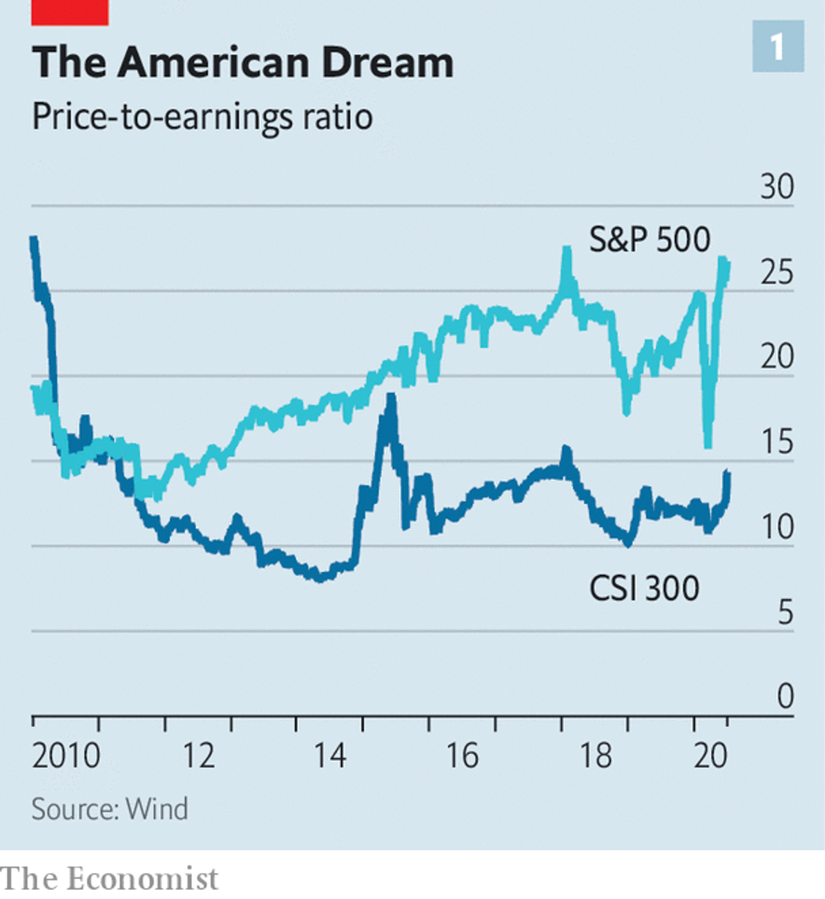
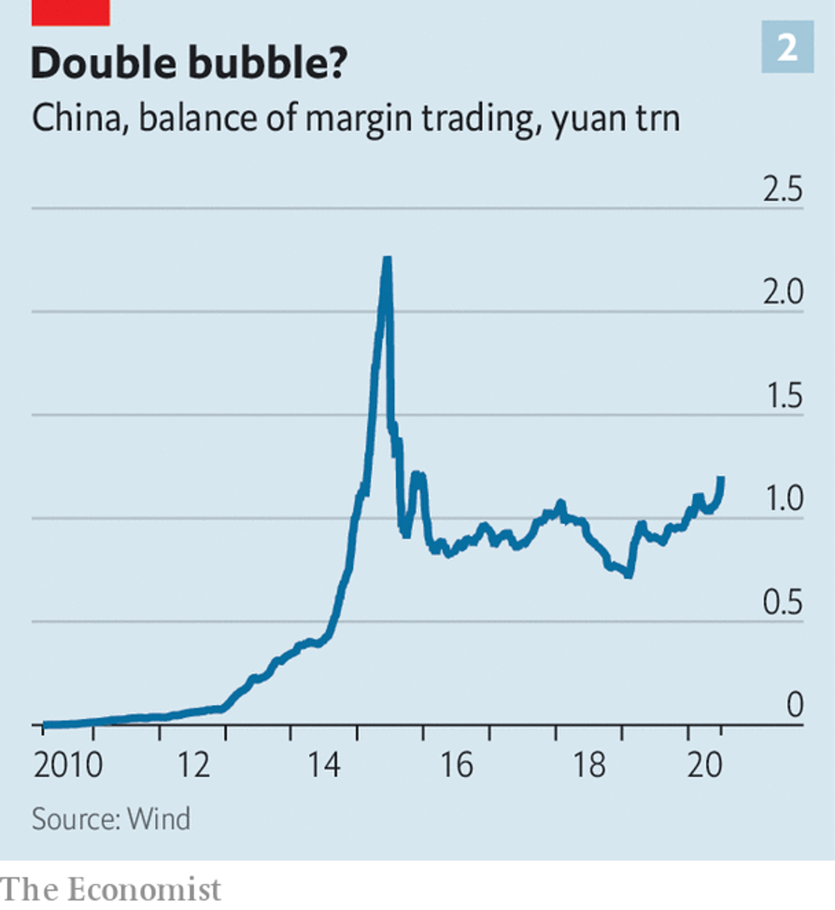

# DAY 142 Stockmarket mania comes to China again. Can it last this time?
1 IN CHINESE STOCKMARKET mythology, the rarest of beasts is the slow bull. The past couple of decades have brought two fast bulls: vertiginous surges in share prices, neither lasting more than a year. Those soon led to fast bears when stocks crashed and, eventually, to slow bears as the descent became more gradual. Most of the time there have been what might be termed long worms as the market moved sideways, such that the CSI 300 index, a gauge of China’s biggest stocks, has averaged the same level over the past five years that it first hit back in 2007. The slow bull—a steady, almost dependable, rise year after year, well known to investors in America—has remained elusive.

2 China’s indomitable punters now hope that a trundling taurus has at last arrived. Stocks have jumped by 15% during the past week and they are up by more than 30% from their low in March. But some believe the bull run will be more enduring than those of the past.

3 For starters, China appears to be in better economic shape than other large economies. Because investors must allocate their funds somewhere, there is always a comparative element to market performance. China is the only big economy forecast to grow this year and is still expected to record the strongest rebound next year, according to IMF projections published in late June. There are grave concerns about the toll that the coronavirus might take in America during this autumn’s flu season. But China has shown every intention of smothering renewed outbreaks, giving people and businesses greater certainty about the path ahead.

4 Market dynamics also seem to be helping. Even after the rally, valuations in China are reasonable. The CSI 300 trades at 14 times the value of company earnings, far below the 27-times multiple of the S&P 500, America’s most-watched share index (see chart 1). Foreign investors have more ways to enter China’s previously walled-off market; many are compelled to do so, because its shares are now included in key indices tracked by institutions. During the first three trading days of July, 44bn yuan ($6bn) flowed into Chinese equities via accounts in Hong Kong, a record high for any three-day period.

5 Although more investors have started buying shares with borrowed money, the outstanding balance of such margin trading is just over half its peak five years ago, during China’s most recent manic run (see chart 2). It is now easier for companies to list shares on the mainland, so new offerings should absorb some of the cash rushing into the market. “This lays the foundation for a slow-bull market that could last for ten or 20 years,” said Chang Shishan of Kangzhuang, an asset-management firm.

6 Nevertheless, it is hard to shake the feeling that the optimists might once again be getting ahead of themselves. The outlook for profitability, which ultimately should determine share prices, is still grim. Over the first five months of 2020, industrial profits were down by 19% compared with a year earlier.

7 Most worrying is the way that the Chinese media are swinging into cheerleading mode, one of the tell-tale signs of past episodes of irrational exuberance. “The clicking of the bull’s hooves is a beautiful sound for our post-virus era,” declared a front-page editorial in the China Securities Journal, a state-run paper, on July 6th. The Shanghai Securities, its sister paper, was less poetic but more direct in an article posted online on July 3rd: “Hahahahaha! It looks more and more like a bull market!” Healthy bulls need only a diet of grass. Injecting them with steroids is an invitation to trouble.

