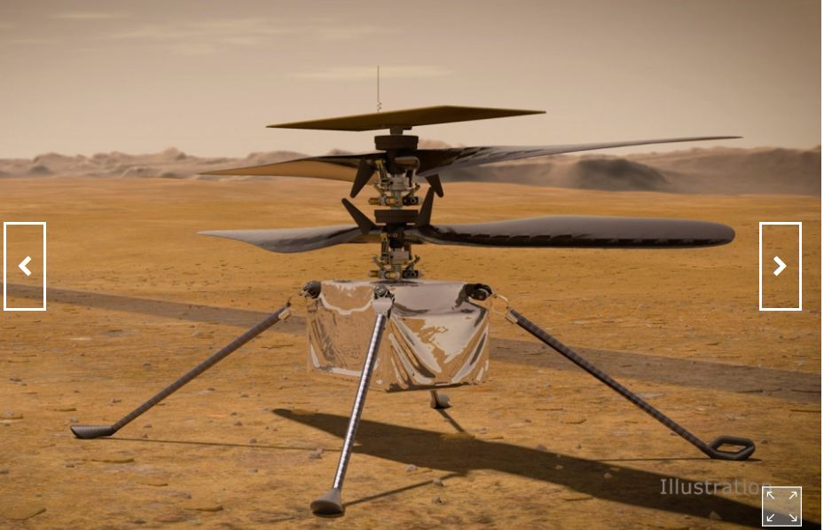

# DAY 161  Mars may be a pristine ecosystem
1 Earth aside, Mars is the most-studied planet in the solar system. Satellites zip around it. Rovers trundle over its surface. **A helicopter may soon clatter through** its skies, for a clutch of new missions are either on their way or planned to launch soon.

2 The motive behind all this is the hope that Mars, like Earth, may support life—or may have done so in the past (see article). And, as technology spreads and rocketry gets cheaper, more people want to join the search for what would, in effect, be Biosphere 2. At first, Mars was the province of America and the Soviet Union. Japan tried and failed to explore it in 1998. Europe sent its first mission in 2003. India launched its in 2013. The United Arab Emirates joined the fray on July 20th. And China, after a failure in 2011, dispatched another attempt on July 23rd. The time is not far off when even private missions might be feasible.

3 Behind all this enthusiasm, though, is a worry. If Mars is sterile after all, or if any life which once dwelled there is now extinct, what people do to the planet by way of contamination with **Earthly bugs** probably does not matter. But if Martians do exist, even if they are but  bacteria (or something vaguely equivalent), that would mean Mars is a pristine ecosystem. Those wishing to investigate it should therefore tread lightly, for reasons of both moral and scientific prudence.

4 Astrobiologists identify two kinds of risk in putative encounters with alien life forms that are not actually toting ray guns. The first, “forward contamination”, is that hardy micro-organisms from Earth might hitch a ride with a space probe and **set up shop** on landing. The second, “back contamination”, concerns the reverse: that samples returned to Earth might bring alien microbes with them.

5 The first risk is no longer theoretical. Scientists reckon that the rovers and landers already on Mars each play host to tens of thousands of microscopic Earthlings. Shielded from radiation by the probes themselves, these bacteria are probably dormant—but not dead.

> A lander is built specifically to descend toward and come to rest on a planet or moon usually transporting something to the surface. A rover is a space exploration vehicle designed to move and explore the surface of a planet or moon.
>

6 Back contamination would require samples to be returned from Mars. That has not happened yet. But America’s newest rover is designed to stash samples of Martian regolith away, to be returned to Earth by a follow-up mission in 2031.
stash away：keep or lay aside for future use

7 Back contamination is the less worrying of the two. Lurid suggestions that Martian bugs might infect human beings ignore the fact that their biochemistry would almost certainly be too different from that of terrestrial organisms for this to happen. Sealed laboratories could provide reassurance for sticklers.

8 Forward contamination is more troubling. Some echo terrestrial worries about conservation, arguing that humans have a moral obligation not to damage other ecosystems. Others fret about the scientific implications. Life on Mars, whether extant or extinct, could be one of the most significant discoveries in the history of biology. **Contamination risks disrupting understanding of that scientific bounty.**

9 Countries are already required, by the Outer Space Treaty of 1967, to worry about these risks. But this treaty is light on specifics, leaving individual space agencies to come up with their own rules. This is better than nothing. But as more countries head for Mars, the case grows for a formal, global approach.

10 Plenty of ideas are worth discussing. Some advocate risk-management, in which the greatest care is taken when explorin**g those parts of Mars most likely to contain life, though lower standards apply in harsher regions.** “Reversible exploration” holds that, if life is discovered, humanity should retrieve the probes that already dot the Martian surface, along with their microbial passengers. And should private individuals be required to follow the same rules as nation-states?

11 International co-operation is not a popular idea just now. Never mind: it should be tried anyway. Nationalism and protectionism can wane as well as wax, and alien-hunting is the work of decades. Counter-measures need not be expensive—experience suggests they add 10% or less to the cost of a probe. And it is hard to think of a more intrinsically global problem than ensuring that one planet’s life forms do not contaminate another’s. ■

> 【the Outer Space Treaty】
>
> 《外层空间条约》（Outer Space Treaty）又名《外空条约》，全称为《关于各国探索和利用包括月球和其他天体的外层空间活动所应遵守原则的条约》，1966年12月19日联合国大会通过，1967年1月27日开放供签署，1967年10月10日生效，永久有效期**。该条约是国际空间法的基础，号称“空间宪法”，规定了从事航天活动所应遵守的10项基本原则**：
>
> （1）共同利益的原则：探索和利用外层空间应为所有国家谋福利，而无论其经济或科学发展的程度如何；
>
> （2）自由探索和利用原则：各国应在平等的基础上，根据国际法自由地探索和利用外层空间，自由进入天体的一切区域；
>
> （3）不得据为己有原则：不得通过提出主权要求，使用、占领或以其他任何方式把外层空间据为己有；
>
> （4）限制军事化原则：不在绕地球轨道及天体外放置或部署核武器或任何其他大规模毁灭性武器；
>
> （5）援救航天员的原则：在航天员发生意外事故、遇险或紧急降落时，应给予他们一切可能的援助，并将他们迅速安全地交还给发射国；
>
> （6）国家责任原则：各国应对其航天活动承担国际责任，不管这种活动是由政府部门还是由非政府部门进行的；
>
> （7）对空间物体的管辖权和控制权原则：射入外空的空间物体登记国对其在外空的物体仍保持管辖权和控制权；
>
> （8）外空物体登记原则：凡进行航天活动的国家同意在最大可能和实际可行的范围内将活动的状况、地点及结果通知联合国秘书长；
>
> （9）保护空间环境原则：航天活动应避免使外空遭受有害的污染，防止地外物质的引入使地球环境发生不利的变化；
>
> （10）国际合作原则：各国从事外空活动应进行合作互助。
>

