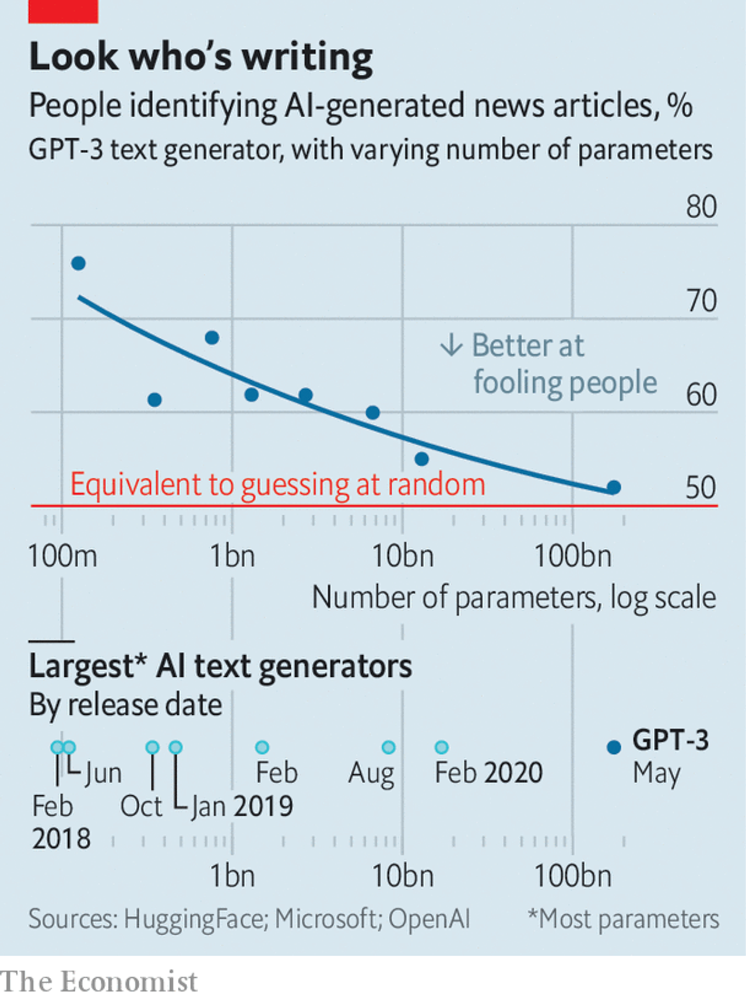
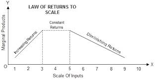

# DAY 175 A new AI language model generates poetry and prose
1 The SEC said, “Musk,/your tweets are a **blight**./They really could cost you your job,/if you don’t stop/all this tweetingat night.”/…Then Musk cried, “Why?/The tweets I wrote are not mean,/I don’t use all-caps/and I’m sure that my tweets are clean.”/“But your tweets can move markets/and that’s why we’re sore./You may be a genius/and a billionaire,/but that doesn’t give you the right to be a bore!”

2 The preceding lines—describing Tesla and SpaceX founder Elon Musk’s **run-ins** with the Securities and Exchange Commission, an American financial regulator—are not the product of some aspiring 21st-century **Dr Seuss**. They come from a poem written by a computer running a piece of software called Generative Pre-Trained Transformer 3. gpt-3, as it is more commonly known, was developed by Openai, an artificial-intelligence (ai) laboratory based in San Francisco, and which Mr Musk helped found. It represents the latest advance in one of the most studied areas of ai: giving computers the ability to generate sophisticated, human-like text.

3 The software is built on the idea of a “language model”. This aims to represent a language statistically, mapping the probability with which words follow other words—for instance, how often “red” is followed by “rose”. The same sort of analysis can be performed on sentences, or even entire paragraphs. Such a model can then be given a prompt—“a poem about red roses in the style of **Sylvia Plath**”, say—and it will dig through its set of statistical relationships to come up with some text that matches the description.

4 Actually building such a language model, though, is a big job. This is where ai—or machine learning, a particular subfield of ai—comes in. B**y trawling through** enormous volumes of written text, and learning by trial and error from millions of attempts at text prediction, a computer can **crunch** through the laborious task of mapping out those statistical relationships.

5 The more text to which an algorithm can be exposed, and the more complex you can make the algorithm, the better it performs. And what sets gpt-3 apart is its unprecedented scale. The model that **underpins** gpt-3 boasts 175bn parameters, each of which can be individually **tweaked**—an order of **magnitude** larger than any of its predecessors. It was trained on the biggest set of text ever amassed, a mixture of books, Wikipedia and **Common Crawl**, a set of billions of pages of text scraped from every corner of the internet.

> **6 Statistically speaking**
>
> The results can be impressive. In mid-July Openai gave an early version of the software to selected individuals, to allow them to explore what it could do. Arram Sabeti, an artist, demonstrated gpt-3’s ability to write short stories, including a **hard-boiled** detective story starring Harry Potter (“Harry Potter, in **ratty** tweed suit, unpressed shirt and unshined shoes, sits behind the desk looking **haggard, rumpled and embittered**…”), comedy sketches, and even poetry (including the poem with which this article opens, titled “Elon Musk by Dr Seuss”). Elliot Turner, an ai researcher and entrepreneur, demonstrated how the model could be used to translate rude messages into politer ones, something that might be useful in many of the more bad-tempered corners of the internet. Human readers struggled to distinguish between news articles written by the machine and those written by people (see chart).
>

7 Given that Openai wants eventually to sell gpt-3, these results are promising. But the program is not perfect. Sometimes it seems to **regurgitate** **snippets** of memorised text rather than generating fresh text from scratch. More fundamentally, statistical word-matching is not a substitute for a coherent understanding of the world. gpt-3 often generates grammatically correct text that is nonetheless **unmoored** from reality, claiming, for instance, that “it takes two rainbows to jump from Hawaii to 17”. “It doesn’t have any internal model of the world—or any world—and so it can’t do reasoning that requires such a model,” says Melanie Mitchell, a computer scientist at the Santa Fe Institute.

8 Getting the model to answer questions is a good way to dispel the smoke and mirrors and lay bare its lack of understanding. Michael Nielsen, a researcher with a background in both ai and quantum computing, posted a conversation with gpt-3 in which the program confidently asserted the answer to an important open question to do with the potential power of quantum computers. When Dr Nielsen pressed it to explain its apparent breakthrough, things got worse. With no real understanding of what it was being asked to do, gpt-3 retreated into **generic** **evasiveness**, repeating four times the stock phrase “I’m sorry, but I don’t have time to explain the underlying reason why not.”

9 There are also things that gpt-3 has learned from the internet that Openai must wish it had not. Prompts such as “black”, “Jew”, “woman” and “gay” often generate racism, **anti-Semitism**, **misogyny** and homophobia. That, too, is down to gpt-3’s statistical approach, and its fundamental lack of understanding. Having been trained partly on text scraped from the internet, it has noted that words like “woman” are often associated with misogynistic writing, and will mindlessly reproduce that correlation when asked.

10 This problem is a hot topic in ai research. Facial-recognition systems, for instance, notoriously do better with white faces than black ones, since white faces are more common in their training sets. ai researchers are trying to tackle the problem. Last year ibm released a set of training images that contained a more diverse mix of faces. Openai itself was founded to examine ways to **mitigate** the risk posed by ai systems, which makes gpt-3’s **lapses** all the more noteworthy. gpt-2, its predecessor, was released in 2019 with a filter that tried to disguise the problem of **regurgitated** **bigotry** by limiting the model’s ability to talk about sensitive subjects.

11 Here, at least, little progress seems to have been made. gpt-3 was released without a filter, though it seemed just as ready to reproduce unpleasant prejudices as its predecessor (Openai added a filter to the newer model after that fact became obvious). It is unclear exactly how much quality control Openai applied to gpt-3’s training data, but the huge quantity of text involved would have made any attempt daunting.

12 It will only get harder in future. Language has overtaken vision as the branch of ai with the biggest appetite for data and computing power, and the returns to scale show no signs of slowing. gpt-3 may well be **dethroned** by an even more **monstrously** complex and data-hungry model before long. As the real Dr Seuss once said: “The more that you read, the more things you will know.” That lesson, it seems, applies to machines as well as toddlers. ■

> Returns to scale, in economics, the quantitative change in output of a firm or industry resulting from a proportionate increase in all inputs.
>

