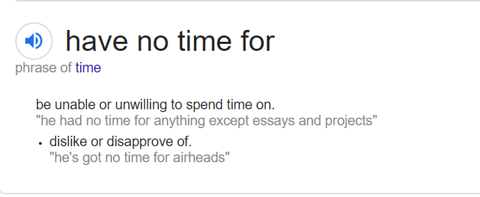

# DAY 76 The real reason to study the classics
1 Why study classical languages? For a long time the reason was clear: there wasn’t much else to read. Medieval Europe read and wrote in Latin, even as its spoken form had changed so much it had become early French and Spanish. During the Renaissance the rediscovery of Greek made it essential for the cultured to know it too. From there, “classics” had **momentum**: even as people started writing in their **vernaculars**, they still learned Latin and Greek, until those languages became a mark of education itself. And since education was limited to the upper classes and clergy, they became synonymous with power. In Britain, the classics carry the **cachet** of the **posh** schools where they have predominantly been taught. Boris Johnson, the latest Old Etonian prime minister, enjoys showing off with **snatches** of Greek.

2 Since overt **snobbery** has fallen from fashion, though, **proponents** of the classics have updated their case. Classical languages are good training for the mind, many now argue. Latin and Greek, with their **panoply** of **case-endings**, force readers and students to pay attention to the grammatical function of every word in a sentence, incidentally improving their English grammar as well. But is learning Latin or Greek really the best way to achieve that goal? To learn cases you could choose a living language such as Russian or German. The best way to learn English grammar is by studying English grammar.

3 Nicola Gardini, a professor of literature at Oxford, has no time for the “trains your mind” argument for Latin; the subtitle of his book “Long Live Latin”, published last year, is “The Pleasures of a Useless Language”. The subject, he insists, is not a “cognitive **boot camp**”. A glorious civilisation was built on the back of Latin. True, Rome’s great works can be read in translation, and discovering them in the original takes effort. But, says Mr Gardini, that lets you “enter the world of the ancients, the very opposite of the desire to haul them into the present age”.

> 1） has no time, 有人查是有“反对”的意思，有人坚持只是“没有时间所以没兴趣”的意思，
>
> 2）最后一句，我总是理解不好，“用古语言阅读原文，可以进入到古人的世界，而不是把他们拉到当今社会”？不太明白这句想表达的到底是什么意思
>
> 1) has no time for 我倾向于理解为: dislike or disapprove of
>
> 2) 学习古语言可以帮我们走进古人的世界，而不是把古人拉到现代。 言外之意是，回到过去真实的历史和语境中，通过一手信息了解语言，会获得更真实的信息。
>

4 Mary Norris’s father was a fireman, and not taken by the practical arguments for Latin, either; he refused to let his daughter learn it. Instead, Ms Norris, today the chief copy editor for the New Yorker, fell in love with Greek, and last year published her own love-letter to it, “Greek to Me”. If Mr Gardini’s book is about a passion for a language and its authors, hers celebrates Greek culture more broadly, with **lashings** of **ouzo** and **island-hopping**. She has studied both the ancient and the modern tongue, experiencing an unexpected attraction to her female teacher. Greek, she concludes, is “sexy”, especially for someone with her **logophilic** cast of mind. Since ancient Greek has given so many **rarefied** words to English, Ms Norris gets a small thrill from being asked “dipsas?” (“Are you thirsty?”) The root that shows up in the English “**dipsomaniac**” is everyday Greek.

5 Coulter George’s new book, “How Dead Languages Work”, is a reminder that Greek and Latin are hardly the only classical languages. A linguist at the University of Virginia, he devotes chapters to Greek, Latin, Old English, Sanskrit, Old Irish and Hebrew. All but Hebrew belong to the Indo-European family, as does English, and Mr George delights in drawing links between them. But he also revels in the quirks that make each unique: Latin’s **ablative** **absolutes** (like mutatis mutandis), Old English’s poetic compounds (like banhus, “bonehouse”, meaning the body), or the rules of “sandhi”, by which Sanskrit words change their sounds based on those adjacent to them. If you are up for a mighty challenge, Old Irish makes Latin look like a lazy **stroll**.

> 1）a linguist 这句，我们后来认为就是指Coulter George本人，他在他的书中有很多章节写到其他语种。但在有几位不太同意。 没问题，就是Coulter本人
>
> 2）Revels in the quirks这一句，“他也对于那些让各语种独一无二的特征非常着迷。”这样的理解应该对的？但是有几位理解不了，主要是quirk这个词的理解。
>
> quirk 是古怪、奇葩的意思。 这里理解为 他沉迷于让各语种变得独特的奇葩之处
>

6 That Greek, Latin, Sanskrit and such are highly complicated, **dripping** with grammatical endings in particular, may suggest such languages forced people to develop a greater rigour of thought. It shouldn’t. All languages are easy for their speakers. Nor were all ancient languages heavily inflected like Greek or Sanskrit. Classical Chinese is virtually the opposite of a language such as Latin—it is almost entirely **monosyllabic** and lacks rigid distinctions between parts of speech. Instead of making it easy, this merely presents different challenges.

7 Mr Gardini gives another reason for studying classical languages: “The story of our lives is just a fraction of all history…life began long before we were born.” This is the very opposite of a practical argument—it is a meditative, even **self-effacing** one. To learn a language because it was spoken by some brilliant people 2,000 years ago is to celebrate the world; not a way to optimise yourself, but to get over yourself.

> 这一句主要就是get over yourself到底该怎么理解，大家很难从词典中找到对应的意思。
>
> get over yourself 不要自视甚高。 结合前面部分，就好理解了， “the story of our lives is just a fraction of all history” 我们自身历史相对于整个人类历史来讲，微不足道，所以不要自视甚高，要学会谦卑。
>

