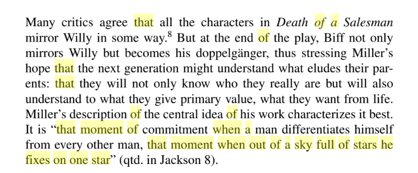

# DAY 80 Arthur Miller
1 FOR most of his life, Arthur Miller was a carpenter. At 14, with the money made from delivering **bagels** on his bike round Harlem, he bought enough wood to build a back porch on the family house. In his old age, living on 360 acres in Connecticut, he made tables, chairs, a bed, a cabinet. To make extra-sure the angles were right, he once consulted a mathematician.

2 He loved making plays—which he did better than any other American of the 20th century, with the possible exception only of Tennessee Williams—for much the same reason. They gave him “an architectural pleasure”. He tried novels occasionally and wrote, in “Timebends” in 1987, a chaotic autobiography. But he revelled in the structure of the drama. He thought of Ibsen and Sophocles, his early influences, as master-carpenters, and of his own best plays as careful constructions of “hard actions, facts, the geometry of relationships”. It was no accident that his male characters were often skilful with their hands, even if they were good at little else.

3 Yet Mr Miller's plays were not conceived as simple artefacts. He meant them to move minds. If they could not do so, there was no point in writing them. His intention was to show the audience, in ordinary characters they might see every day, truths about themselves that they half-knew but would not acknowledge. Realising they were not alone in whatever they foolishly feared or unwisely hoped for, they might find the courage to change.

4 In “Death of a Salesman” (1949), the play that brought him global fame, he displayed in Willy Loman the futility of a salesman's life, the fragility of his dreams, his longing to leave a lasting mark on the world—and also, though Willy could not see it, the persistent strength of his family's love for him. In “A View from the Bridge” (1955) he anatomised, in Eddie Carbone, the unacknowledged terrors of incestuous passion. In several plays, the last written only a year before his death, he tried to unravel his own relationship with Marilyn Monroe, his wife for almost five years. She remained surrounded, however, by “a darkness that perplexed me”.

> a darkness that perplexed me  出处：
>

5 He also plunged into the past in order to illuminate the present. His account of the 17th-century Salem witch trials in “The Crucible” (1953) gave him the metaphor he needed to describe McCarthyism, a plague that touched him directly when he was called before the House UnAmerican Activities Committee in 1956 for attending meetings of communist writers. (He refused to name names, was held in contempt of Congress, fined, and had his passport withdrawn.) His play “Broken Glass” (1994), ostensibly about the 1930s, was intended as a commentary on public indifference to the Yugoslav wars of the 1990s. His audiences did not always notice these parallels, but they were always meant to.

> **Fixing on a star**
>

6 Throughout his work, his message was consistent. Actions had consequences, and the individual was responsible not only for his own acts, but for what he knew others were doing. In “All My Sons” (1947), his clearest statement of this philosophy, a father had secured the future of his family by shipping defective aircraft parts that had caused pilots to die; eventually, his own son reported him. There were moments, Mr Miller wrote, “when an individual conscience was all that could keep a world from falling.”

7 On the other hand, his characters were seldom that strong. Outside forces—destiny, law, political authority, sudden catastrophe—often overwhelmed them. As a child during the Depression, he had seen his father's coat-making business destroyed and his mother, whom he remembered in fox-fur and diamonds, reduced to eking out shovelfuls of coal. His father and his colleagues, he noticed, never blamed anyone but themselves for what had happened. Mr Miller, already imbued with his lifelong socialism, tried to persuade his shellshocked father to blame the capitalist system too, and accept that profit was wrong. His father, naturally, could not begin to understand him.

8 His career was not all adulation. He had a dry patch in the 1960s, when he felt he did not speak with the accent of the time, and by the 1980s the all-powerful New York critics (whom he loathed) seemed to be tired of him. Constantly, critics objected to his blatant stage moralising: “like neon signs”, one wrote, “in a diner window.”

9 Mr Miller was unapologetic. He had a purpose, he confessed, even beyond teaching. Though he seemed to be didactic, he was in fact asking questions: “How can we be useful?” “Why do we live?” He was, he once admitted, “in love with wonder...the wonder of how things and people got to be what they are.” The aim of each of his plays was to discover which commitment or challenge his main character would accept, and which he would walk away from: “that moment when out of a sky full of stars he fixes on one star.”

10 He remembered his own such moment, when he decided to be a writer. It came when, reading Dostoevsky's “The Brothers Karamazov” as a teenager, he discovered that among the most breathtaking passages were accumulations of hard, simple fact: “the kind of bark on the moonlit trees, the way a window is hinged”. As well as the playwright, it was the carpenter speaking.

> **另外一篇关于他的文章**:
>
> **https://www.theguardian.com/stage/2005/feb/19/theatre.stage**
>

