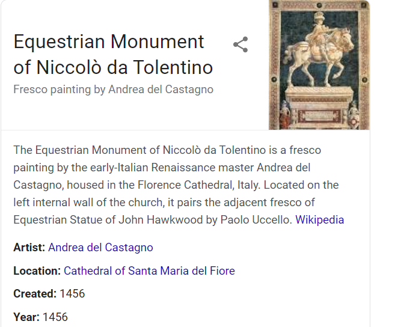
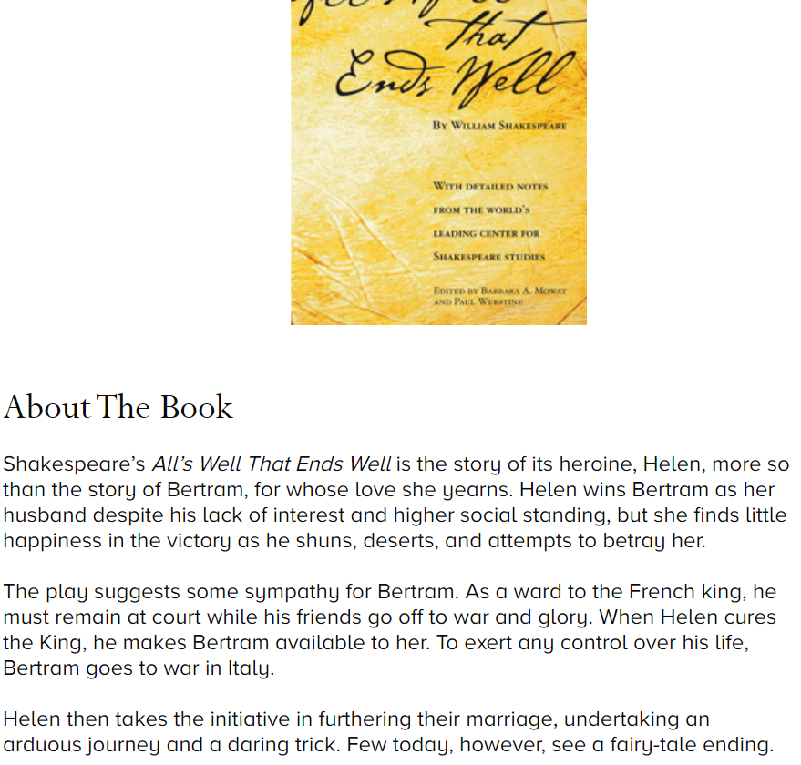

# DAY 83 How pandemics have inspired art, music and literature
1 WHEN TOURISTS return to Florence, some will wander into its cathedral and be struck by Andrea del Castagno’s “Equestrian Monument of Niccolò da Tolentino”. Painted in 1456, the fresco of the mercenary commander and his horse is an optical illusion. The pair are depicted as a statue and the perspective scheme enables the painting to be viewed from different angles. As they walk on, some of those tourists who admire it may speculate what more the artist might have achieved had not the plague, which returned to Florence in 1457, killed him in his mid-30s.

2 Pandemics and culture have gone hand in hand for millennia. The earliest iteration of the disease that did for Andrea del Castagno was the Black Death, which arrived in Europe in 1347. It killed between a third and a half of the population, but it also helped clear a path to the Renaissance by bringing about great changes in the economic and social order. The Black Death did not directly lead to the Renaissance, says John Henderson, the author of a recent book on plagues, “Florence Under Siege”. But it did lead to a greater concentration of wealth among a smaller number of people. “Wages doubled. The rich became even richer,” he says. That, in turn, gave them the means to finance great art.

3 The pandemic may even have left its mark on styles of painting. In the first decade of the 14th century Giotto had produced a cycle of unprecedentedly life-like frescoes in the Arena Chapel in Padua, depicting the expression of human emotions with a realism that became a hallmark of Renaissance art. But, as Leonardo da Vinci wrote, “After [Giotto], art fell back.” For a while at least, painters largely abandoned spatial rendering and lively expression for archaic, stylised forms of representation. Professor Henderson suggests the trauma of the plague may have rekindled an enthusiasm for the familiar; just as many under lockdown today have turned to comforting, well-thumbed novels and undemanding old movies.

4 Pandemics shaped creativity in other ways, too. Giovanni Boccaccio’s “The Decameron” (1353), in which ten young people swap tales while sheltering from the Black Death, is the best-known example. One of Boccaccio’s stories was borrowed by William Shakespeare for “All’s Well that Ends Well”. They have also inspired operas and works of poetry and prose, including at least one novel in Arabic, Saad Elkhadem’s “The Plague” (1989), in which the fear-inducing disease is Gamal Abdel Nasser’s dictatorship.

5 The virus that ravaged Florence as Boccaccio’s characters spun their yarns returned again and again. The last outbreak in Europe was in 1743 in Messina, the very port through which the disease had entered the continent almost four centuries earlier. Living with the ever-present threat produced genres of pestilential art, often sponsored—lavishly so—by penitential societies or confraternities. The aim was usually to invoke the protection of the Virgin Mary or two saints regarded as particularly effective against disease: Saint Sebastian and Saint Roch.

> 和这种无处不在的威胁共存中，大量的瘟疫艺术形式被创造出来，这些艺术形式通常是由忏悔性协会或团体慷慨资助的。
>

6 Meanwhile, doctors and clerics agreed from an early stage on the therapeutic value of music—though they sometimes differed on whether the music that lifted spirits was appropriate for protecting souls. Much devotional music was intended to be sung in the penitential processions that wound their way through the cities of Europe in times of plague.
This has contemporary resonance. In the early stages of lockdown in March, Italians went on their balconies and terraces to sing and play music. In doing so, they were unwittingly imitating their 16th-century predecessors. Concerned that penitential processions encouraged contagion, the Archbishop of Milan, Carlo Borromeo, “encouraged citizens to sing from their doors and windows in order to collectively perform the public rituals while quarantined inside their own homes,” according to Remi Chiu, a musicologist, in “Plague and Music in the Renaissance” (2017).

7 Other forms of art have flourished during, or just after, other outbreaks of disease. The first of the three great cholera pandemics of the 19th century, which began in India in 1817, was followed by the first post-apocalyptic novel. Mary Shelley’s “The Last Man” (1826) offers an even grimmer vision of humanity’s future than Cormac McCarthy’s “The Road” (2006). The Austrian artist Egon Schiele drew his mentor, Gustav Klimt, as he lay dying from the influenza pandemic in 1918 (known, unfairly, as the “Spanish flu”). Schiele himself succumbed after finishing the drawing. Virginia Woolf, who suffered heart damage from her encounter with the flu, conferred her resulting debilitation on the title character of her novel, “Mrs Dalloway” (1925).

8 Elizabeth Outka, a professor at the University of Richmond in Virginia, argues that traces of the psychological effects of the 1918-20 flu pandemic can also be detected in works of the inter-war period written by other survivors. She sees the shadow of the virus in T.S. Eliot’s “The Waste Land” (1922), in which death can seem ever-present:
Under the brown fog of a winter dawn,
A crowd flowed over London Bridge, so many,
I had not thought death had undone so many.

9 What do these forms of art, both modern and older, have in common? Several themes recur. One is the notion of a pandemic as a “great leveller”. It is a dubious proposition in the light of current studies showing the poor are hit the worst, but before statistical analysis, it was a common motif in the 15th-century artistic genre of the Dance of Death. It features in Edgar Allan Poe’s cholera-inspired short story, “The Masque of the Red Death” (1842), in which a prince and his court shut themselves away to escape an epidemic, but find the lethal disease has slipped in as an uninvited guest at their masked ball. In some of the early commentary around covid-19, the theme crept back in.

10 Another recurring notion is that contagious illnesses bring out the best and worst in humanity. It is among the themes of Italy’s most celebrated 19th-century novel, Alessandro Manzoni’s “The Betrothed” (1827). Set during the plague of Milan in 1629-31, the story contrasts the heroic altruism of Fra Cristoforo, a Capuchin friar, with the cowardice and worldliness of another priest, Don Abbondio. Soon after Italy went into lockdown in March, Pope Francis told his priests: “in times of pandemic, you should not be Don Abbondios”. It was an ominous reproof. In the novel, Don Abbondio lives; Fra Cristoforo is infected and dies.

11 That gives an ironic twist to the most prevalent theme of all: the pandemic as punishment. For millennia humans have needed to rationalise catastrophe, and in doing so have turned to the notion of the wrath of God or the Gods. In Homer’s “The Iliad”, Apollo infects the Achaeans for kidnapping the comely daughters of one of his priests and turning them into sex slaves. In the Old Testament, God sends a plague to the Israelites on the puzzling grounds that King David had ordered a census. And in his account of the first great outbreak of plague in Europe, which began in 541, the Byzantine historian Procopius puts it all down to God’s will. But he noted the disease, which went on to halve the population of Europe by around 700, had a knack of letting the worst survive (possibly a dig at the emperor Justinian, who contracted the disease, but recovered).

12 Islam took the view that the victims of pandemics were martyrs who thus went straight to heaven. But millions of Christians have died of infectious diseases believing it was their own fault. Countless paintings from the 14th to the 17th centuries show an angry God presiding over indiscriminate annihilation. As Susan Sontag argued in “Illness as Metaphor” (1978), victim-blaming has continued in modern times. Cancer was once seen as the result of inhibited emotions. AIDS was stigmatised for years as the presumed penalty for uninhibited ones.

13 So what of covid-19? Some American evangelical preachers are keen to portray it as a hoax rather than a reprisal. But Ralph Drollinger, the leader of the White House bible study group, has ascribed it to God’s disgust with gays, lesbians and environmentalists. By contrast Jane Goodall, a leading environmental campaigner, has argued that “it’s our messing with nature, cutting down forests, bringing people and animals close together, hunting animals and eating them…that’s led to these viruses spreading from animals to people.” Meanwhile, the covid-inspired novels, artwork, and music have yet to materialise. When they do, they will join a long, rich tradition.

